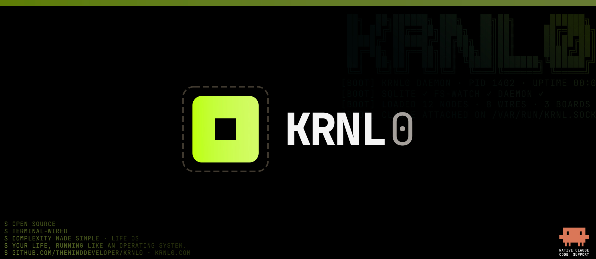
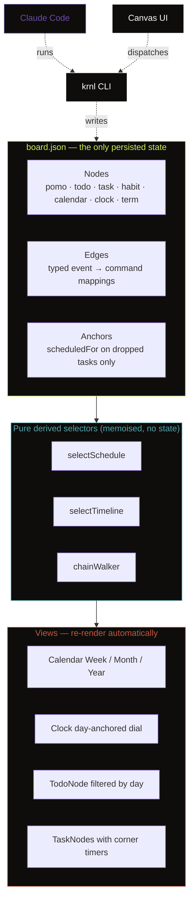
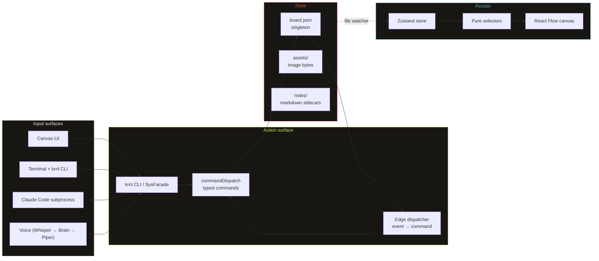
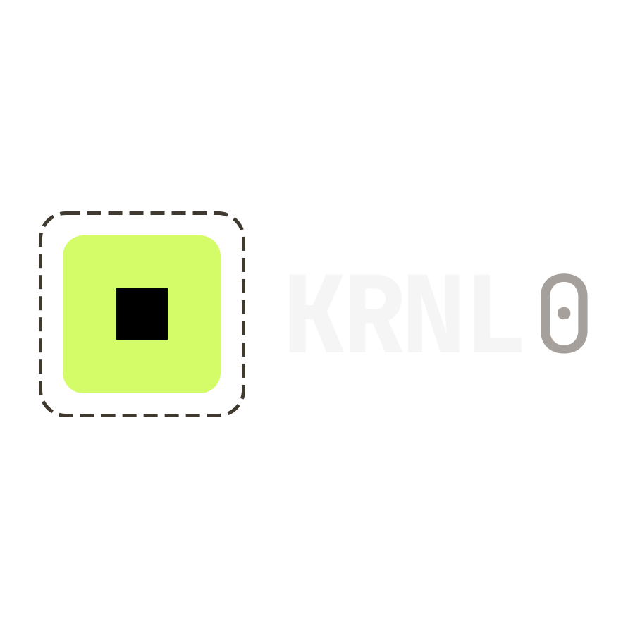

<div align="center">



<br /><br />

# KRNL0

#### One canvas. Every productivity app. Single source of truth.
Pomodoro, Todos, Tasks, Habits, Calendar, Clock, and a real Terminal anchored as connectable nodes on one infinite whiteboard, all derived from a single `board.json`.

<br />

[](LICENSE.md)
[](#quickstart)
[](docs/07-roadmap/build-roadmap.md)
[](#architecture)
[](tsconfig.json)
[](docs/03-adr/)

<br />

<p align="center">


</p>

---
[Documentation](docs/) · [Architecture](docs/03-architecture/) · [ADRs](docs/03-adr/) · [Visual System](docs/04-visual-system/)  · [Challenges Journal](docs/Challenges.md)

</div>

---

## Overview

Most productivity stacks are several apps that don't share state. A focus session relates to a task; a habit feeds a goal; a calendar blocks both. The separation is an artifact of how the apps were built, not how the work flows.

KRNL0 puts every primitive on one canvas as a node, and lets them communicate. Drop a task on the calendar — the entire chain auto-positions back-to-back. Wire a Pomodoro to a habit — finishing the timer ticks the streak. Type `claude` in the embedded terminal — the AI operates the same `krnl` CLI you do.

**One file (`board.json`) is the only persisted state. Every view derives from it.**

<div align="center">

</div>

---

## What it replaces

| Category | Tools you use today | KRNL0 node |
|---|---|---|
| Infinite canvas | Miro, FigJam, tldraw | The canvas itself |
| Pomodoro timers | Pomofocus, Forest, Be Focused | `pomo` mother |
| Todo lists | Things, Todoist, Apple Reminders | `todo` mother |
| Tasks & projects | Notion, Linear (light) | `todo.task` DAG |
| Habit trackers | Streaks, Habitica, Loop | `habit` mother |
| Calendars | Notion Calendar, Cron, Fantastical | `calendar` mother |
| Time analytics | RescueTime, Toggl, Clockify | Heatmaps + corner timers |
| Terminal | Warp, iTerm, Hyper | `term` mother (real PTY) |
| AI assistant | ChatGPT tab, Claude.ai | `claude` natively in `term` |

---

## The node system

Every productivity primitive is a node with typed events and typed commands. They share one source of truth and communicate through edges stored as data in `board.json`.

### Mother nodes (anchored)

| Node | Kind | What it does |
|---|---|---|
| **Pomodoro** | `pomo` | Vapor-pill timer with draining liquid, session pips, configurable session/break, blinking colon. Linkable to an active task — the task accumulates seconds in the corner. |
| **Todos** | `todo` | Tagged task list. Items spawn `todo.task` children, which form chains via `task.next` edges. Filterable by calendar day selection. |
| **Habits** | `habit` | Week / Month / Year (GitHub-style 53×7 heatmap) views. Color-coded streaks. Schedulable daily / weekly / weekdays. |
| **Calendar** | `calendar` | Week / Month / Year views. Hour grid with now-line. Drop-to-schedule for tasks and habits. Habit dots and Pomodoro completion heatmap layer on top. |
| **Terminal** | `term` | Real PTY (`node-pty` + WebGL `xterm.js`). Hosts `claude`, `git`, `npm`, the `krnl` CLI — anything. |

### Viewers and children

| Node | Kind | What it does |
|---|---|---|
| **Clock** | `clock` | Day-anchored 12-hour wall-clock dial. Concentric rings for parallel branches. Independent day cursor. |
| **Tasks** | `todo.task` | Free-floating cards. Form a DAG: `Add subtask`, `Add next task`, `Add parallel task`. Click body → load into Pomo. |
| **Sessions, days** | `pomo.session`, `habit.day` | History records spawned by mothers when sessions complete or days are toggled. |
| **Notes, images** | `text`, `image` | Free child nodes for context, reference material, screenshots. |

---

## Three workflows that show the system wiring itself together

### 1. Cascade scheduling

Drop one task on the calendar — the entire `task.next` chain auto-positions back-to-back. Only the dropped task stores `scheduledFor`; every successor's position is derived at read time by the `selectSchedule` selector.

| Time | Task | Source |
|---|---|---|
| 14:00 | Outline chapter 3 (50 min) | **Anchor** — you dropped this here |
| 14:50 | Draft section 3.1 (25 min) | Derived |
| 15:15 | Draft section 3.2 (25 min) | Derived |
| 15:40 | Review notes (parallel A, 30 min) | Derived |
| 15:40 | Cite-check (parallel B, 45 min) | Derived (shared start) |
| 16:25 | Stretch + tea (15 min) | Derived |

Edit any duration upstream — every downstream block re-positions instantly. Pin a second anchor mid-chain and both fixpoints coexist. No write fan-out, no de-normalisation.

> Specs: [ADR 0003 — Cascade scheduling](docs/03-adr/0003-cascade-scheduling.md) · [ADR 0005 — Multi-anchor cascade](docs/03-adr/0005-multi-anchor-cascade.md)

### 2. Habit drag-to-schedule

Drag a habit from the Habit mother onto a calendar cell. A radial chooser appears at the drop point with three options — **Daily**, **Weekly**, **Weekdays** — styled in the Apple Liquid Glass material (`backdrop-filter: blur(24px) saturate(180%)`). Click a wedge to confirm; click the dead zone or press <kbd>Escape</kbd> to cancel.

The chooser is a reusable primitive (`useRadialChooser`), portaled to `document.body` with `z-index: 2147483000`. Future drag interactions — edge-type pickers, Pomo preset assignment — will reuse the same hook.

> Spec: [ADR 0002 — Radial chooser & habit scheduling](docs/03-adr/0002-radial-chooser-and-habit-scheduling.md)

### 3. Native Claude Code in the terminal

The Terminal mother is a real PTY. Type `claude` and the full Claude Code agent runs on the canvas, reading `claude/CLAUDE.md` and `claude/skills/*.md` for context.

```bash
$ claude "plan a thesis afternoon — three deep blocks plus one break"

► Reading claude/CLAUDE.md and skills/plan-session.md
► krnl task add "Outline chapter 3"   --duration 50
► krnl task add "Draft section 3.1"   --duration 25 --next-of <id1>
► krnl task add "Draft section 3.2"   --duration 25 --next-of <id2>
► krnl task add "Stretch + tea"       --duration 15 --next-of <id3>
► krnl task schedule <id1> 2026-05-20T14:00
✓ Cascade scheduled. Pomo armed.
```

There is no backdoor. Claude uses the same `krnl` CLI a power user types. It reads `board.json` for context, dispatches commands, the file watcher fires, the canvas re-renders.

> Spec: [Decision 3 — How Claude drives the app](docs/03-architecture/decisions.md) · [TerminalNode requirements](docs/06-requirements/terminal-node.md)

---

## Single source of truth



**Persist intent, derive presentation.** A running Pomodoro stores `startedAt` — the countdown is computed every render. A scheduled task stores `scheduledFor` once — every successor in its chain is derived. Close the app, reopen — every view shows the right state.

`board.json` has a strict round-trip contract: `load → save → byte-identical` (modulo `savedAt`), tested on every CI run.

> Specs: [Node specification](docs/05-node-system/node-spec.md) · [Design patterns map](docs/03-architecture/design-patterns.md)

---

## Architecture



**One mutation path.** `krnl` is the only writer of `board.json`. The UI dispatches through it; the AI runs it; the edge dispatcher fires it. No component bypasses the facade.

**Six unbreakable rules** for every node — state is JSON-serializable, render is pure, commands mutate state, events are typed strings, no cross-node imports, no privileged access. Mothers play by the same rules as children — *anchored* and *cannot delete* are kernel properties, not node-level overrides.

> Specs: [Three-layer overview](docs/03-architecture/three-layer-overview.md) · [Decisions log (250+ lines, 25+ decisions)](docs/03-architecture/decisions.md)

---

## The `krnl` CLI

Every GUI action has a CLI equivalent. Every read command supports `--json`. Every ID argument accepts an 8-character prefix or a unique name.

```bash
krnl info --json                                # mother ids + node counts
krnl board show --json                          # full board state

krnl task add "Outline chapter 3" --duration 50 --tag deep
krnl task add "Draft section 3.1" --duration 25 --next-of <id>
krnl task schedule <id> 2026-05-20T14:00        # cascade fires
krnl task pomo <id>                             # load into Pomo, start

krnl habit add  "Morning meditation"
krnl habit done "Morning meditation"
krnl habit color "Morning meditation" cyan

krnl edge add  --from "<pomoId>:onComplete" --to "<habitId>:markDone"
krnl edge list

krnl calendar setView month
krnl pomo start --label "deep work" --minutes 50
```

Internally, `krnl` is the user binary; `sys` is the corresponding facade module. The two are interchangeable in command shape — `sys` is what older docs reference.

> Spec: [AI Full-Visibility CLI requirements](docs/06-requirements/ai-full-visibility-cli.md)

---

## Visual system

Aesthetic direction: **Anthropic warmth × cyberpunk ASCII** — the native theme is called *cyber*. Warm paper tones at rest; acid green, rust, and cyan as high-signal accents.

### Color families

| Token | Hex | Meaning | Used for |
|---|---|---|---|
| `--acid` | `#c9f158` | Active focus | Running Pomo ring, listening orb, terminal cursor |
| `--cyan` | `#4ea8b0` | Todo kinship | Todo + Task selection rings, animated task-flow edges |
| `--rust` | `#c8553d` | Danger / stop | Pomodoro timer, RESET, delete, error states |
| `--spine` | `#5e7d1d` | Mother identity | Anchored mother slot tags, fixed-corner brackets |
| `--plum` | `#6b4ea8` | Reserved accent | Radial-chooser stroke, "thinking" orb state |

`--acid` is invariant across light and dark — it's a signal, not a shade. The Terminal node is always dark regardless of host theme.

### Themes

|  | **cyber** *(default)* | **noir** *(`data-vibe="noir"`)* |
|---|---|---|
| Vibe | Warm paper × acid neon | High-contrast monochrome |
| Accent | `#c9f158` lime | `#fafaf6` near-white |
| Node radius | 10px | 0px sharp corners |
| Letter-spacing | 0.04em | 0.18em uppercase |
| Effects | Acid glow, edge pulses | None — geometry only |

> Specs: [Design tokens](docs/04-visual-system/design-tokens.md) · [Styling philosophy & color contract](docs/03-architecture/styling-philosophy.md)

---

## Documentation

The `docs/` folder is held to professional spec standards. Every architectural decision is recorded as an ADR with binding contract code. Every node has Functional Requirements + Use Cases + Gherkin scenarios. Every hard bug solved is journaled in plain language. Treat this repo as a reference for how to document a serious solo build.

| Folder | Contents |
|---|---|
| [`docs/01-concept/`](docs/01-concept/) | Vision, framing, motivation |
| [`docs/02-prd/`](docs/02-prd/) | PRD v0.6.0 — locked specification |
| [`docs/03-architecture/`](docs/03-architecture/) | Three-layer overview, design patterns map, 25+ decisions log, styling philosophy |
| [`docs/03-adr/`](docs/03-adr/) | Five binding ADRs: Calendar, Radial Chooser, Cascade, Clock day-anchor, Multi-anchor |
| [`docs/04-visual-system/`](docs/04-visual-system/) | Design tokens, color contract, typography, density modes |
| [`docs/05-node-system/`](docs/05-node-system/) | Node contract — state, config, events, commands, six rules |
| [`docs/06-requirements/`](docs/06-requirements/) | Per-node specs with Functional Requirements, Use Cases, Gherkin scenarios |
| [`docs/07-roadmap/`](docs/07-roadmap/) | 10-week build roadmap, references |
| [`docs/08-history/HISTORY.md`](docs/08-history/HISTORY.md) | Every merge logged with PRs, files changed, summary |
| [`docs/Challenges.md`](docs/Challenges.md) | Plain-language journal — Symptom → Wrong Guesses → Real Cause → Fix → Lesson |

Every ADR follows the same structure: Context, Decision, Contract (with file paths and binding code shapes), Consequences, Alternatives Rejected, recommended slice ordering. Open [ADR 0003](docs/03-adr/0003-cascade-scheduling.md) for a representative example.

---

## Quickstart

Requires **Node 20+** and **npm 10+**.

```bash
git clone https://github.com/theMindDeveloper/krnl0
cd krnl0
npm install         # runs electron-rebuild for node-pty automatically
npm run dev         # opens the canvas
npm test            # vitest — Gherkin-shaped scenarios per node
npm run typecheck   # strict TypeScript, zero `any`
```

### Optional providers

| | Provider | Install | Purpose |
|---|---|---|---|
| Brain (default) | Claude Code | `npm i -g @anthropic-ai/claude-code` | Uses your subscription via `claude -p` subprocess |
| Brain (fallback) | Anthropic API | Bring your own key | Pay-per-token via HTTPS |
| Brain (offline) | Ollama | [`ollama.com`](https://ollama.com) | Fully local LLM |
| STT | Whisper.cpp | [`ggerganov/whisper.cpp`](https://github.com/ggerganov/whisper.cpp) | Local speech-to-text |
| TTS | Piper | [`rhasspy/piper`](https://github.com/rhasspy/piper) | Local text-to-speech |

---

## Roadmap

10-week solo build. Live demo on **20 Jul 2026**.

| Week | Focus | Status |
|:---:|---|:---:|
| 1 | Setup, kernel, persistence round-trip | ✅ |
| 2 | Canvas, four mother nodes | ✅ |
| 3 | Edges, child nodes, dispatcher | ✅ |
| 4 | Terminal node + `krnl` CLI | ✅ |
| 5 | Voice STT + brain provider | ✅ |
| 6 | Voice TTS + reply loop | ✅ |
| 7 | Calendar mother + cascade *(ADR 0001, 0003, 0005)* | 🔄 |
| 8 | Habit scheduling + Clock day-anchor *(ADR 0002, 0004)* | 🔄 |
| 9 | Polish, theming, density modes | ⏳ |
| 10 | Demo prep, packaging, walkthrough | ⏳ |

> Full plan: [`docs/07-roadmap/build-roadmap.md`](docs/07-roadmap/build-roadmap.md)

---

## Inclusive design

Built for HTW Berlin, course *Natural User Interfaces · Inclusive Design*. The architecture enforces R10: fully operable without mouse OR without keyboard.

| Modality | Audience | Mechanism |
|---|---|---|
| Voice | Low-vision, motor-limited | Orb → Whisper → Brain → Piper |
| Visual / pointer | Standard | Canvas + drag interactions |
| Keyboard / CLI | Power users, screen readers | `krnl` in Terminal node |

All three converge on the same `krnl` surface, the same `board.json`, the same canvas. Color is never the only signal — every state has a shape or label too.

---

## License

[**Functional Source License v1.1**](LICENSE.md), with an Apache 2.0 future grant.

| | |
|:---:|---|
| ✅ | Use, fork, modify, self-host, contribute |
| ✅ | Build plugins and themes |
| ❌ | Sell as a competing commercial product |
| 🕒 | Each release becomes Apache 2.0 two years after publication |

---

<div align="center">



<br />

Built solo · Made in Berlin · [theminddev](https://github.com/theMindDeveloper) · 2026

</div>
