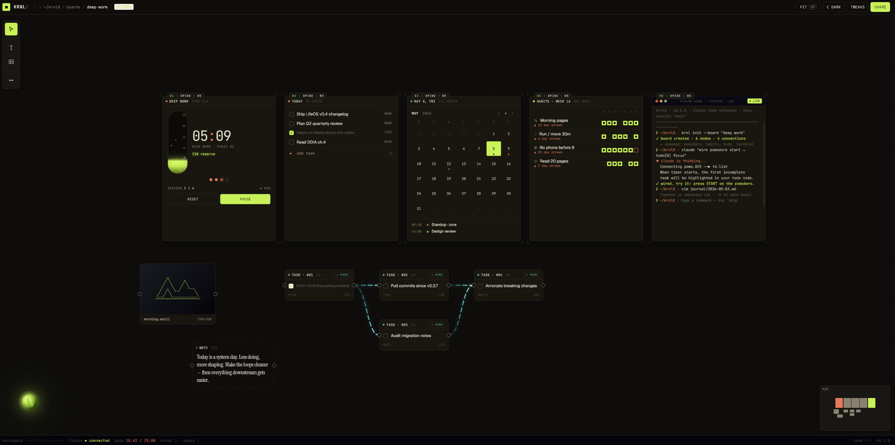

# 🧪 KRNL0 🧪

<div align="center">

**The Life OS. One canvas for everything you do.**

Pomodoro, todos, habits, kanban, notes, projects — all on one infinite whiteboard.
Wire them together. Drive them with AI. Talk to them.

[Docs](docs/) · [Architecture](docs/03-architecture/) · [Roadmap](docs/07-roadmap/build-roadmap.md) · [PRD](docs/02-prd)

</div>

---

## Demo




---

## What is krnl0?

Imagine **Miro** — but the sticky notes are real tools. A Pomodoro timer that fires events when it ends. A habit tracker that listens for those events. A todo list that's wired to a kanban board. A terminal that can drive any of them. An AI assistant that speaks to all of it.

krnl0 is a single canvas where every productivity primitive — focus timers, tasks, habits, projects, notes — lives as a connectable node. You design your own system by wiring nodes together, then let an LLM run it for you through a real CLI.

> *"Plan a two-hour deep-work block on the thesis, then a walk."*

The assistant takes that, runs `sys` commands, and the canvas updates live.

---

## Features

- **Infinite canvas.** Pan, zoom, arrange. Miro-style spatial workspace.
- **Connectable nodes.** Pomodoro, Todos, Habits, Terminal — each emits events and accepts commands. Wire them with edges.
- **AI-native.** Drop-in support for Claude Code, the Anthropic API, or local Ollama. The AI uses the same `sys` CLI you do — no special API.
- **Voice control.** Whisper STT + Piper TTS, both local. Push-to-talk, get a spoken reply.
- **Real terminal.** Not a fake REPL. A full PTY (`node-pty` + `xterm.js`) where you can run `claude`, `git`, anything.
- **Local-first.** Your board is one human-readable JSON file in `~/Documents/krnl0/`. No cloud, no account.
- **Programmable.** Every GUI action is reachable from `sys`. If you can click it, you can script it.
- **Cross-platform.** macOS, Windows, Linux via Electron.

---

## Quickstart

Requirements: **Node 20+**, **npm 10+**.

```bash
git clone https://github.com/theMindDeveloper/krnl0
cd krnl0
npm install
npm run dev
```

Voice + AI providers (optional, install separately):

- **Claude Code** (`npm i -g @anthropic-ai/claude-code`) — default brain
- **Whisper.cpp** — STT
- **Piper** — TTS
- **Ollama** — offline brain

---

## `sys` CLI

```bash
sys pomo start --label "thesis writing" --minutes 25
sys todo  add  "call mom" --tag personal
sys habit done meditation
sys edge  add  --from pomo:onComplete --to habit:markDone --args habit=deep-work
sys board show
```

Every command supports `--json` for scripting. Full reference: [`docs/02-prd/PRD-v0.6.0.md`](krnl0-PRD-v0.6.0.md).

---

## Architecture

Three layers, no shortcuts between them:

```
VOICE I/O   →   BRAIN (Strategy)   →   ACTION & STATE
Whisper         ClaudeCodeProvider     sys CLI → board.json
Piper           ApiProvider            File watcher → React canvas
                OllamaProvider
```

The Brain runs whatever LLM you configure. It reads `board.json` for context, executes `sys` subcommands to mutate state, and replies in plain English (rendered + spoken). Full design: [`docs/03-architecture/`](docs/03-architecture/).

---

## Tech stack

Electron · TypeScript (strict) · React · Zustand · Zod · xterm.js · node-pty · Vitest

---

## Status

v0.1 in active development. 10-week build to a live demo on **20 Jul 2026**. See [`docs/07-roadmap/build-roadmap.md`](docs/07-roadmap/build-roadmap.md).

---

## Contributing

Issues and PRs welcome once v0.1 ships. The architecture is locked in [PRD v0.6.0](krnl0-PRD-v0.6.0.md) — read it before opening a structural PR.

---

## License

[Functional Source License v1.1](LICENSE.md), with an Apache 2.0 future grant.

- ✅ Use, fork, modify, self-host, contribute
- ✅ Build plugins and themes
- ❌ Sell as a competing commercial product
- 🕒 Each release becomes Apache 2.0 two years after publication

---

<div align="center">

*Built solo. Made in Berlin. theminddev 2026*

</div>
