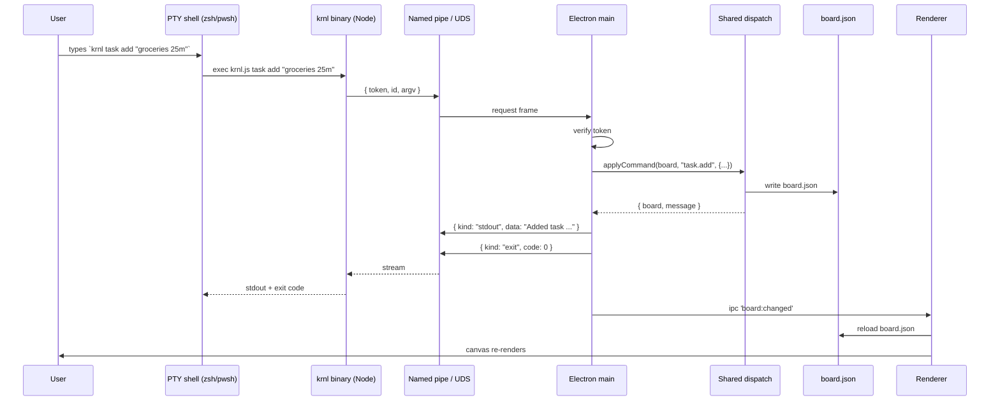
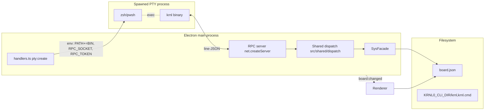

# ADR-0014 — Terminal CLI Bridge: `krnl` Inside the PTY

*Numbered ADR-0014 per filename convention; entry in `decisions.md` is Decision 23 (next free slot — see decisions log §Numbering note).*

**Date:** 2026-05-14
**Status:** Accepted
**Author:** architect
**Supersedes:** none. **Extends:** Decision 12 (TerminalNode IPC contract), Decision 3 (Claude Code drives via CLI), Decision 4 (one command surface).

---

## 1. Context

The terminal node ships PTY + xterm wired through 6 IPC channels (Decision 12). A `sys` CLI exists at `src/sys/` with a Facade that mutates `board.json` directly. The renderer also has `sys:run` as a renderer→main IPC.

But the headline feature of KRNL0 — **Claude Code, running inside the terminal node, drives the app** (Decision 3) — does not work end-to-end today, because:

1. `sys:run` is a **renderer-to-main** IPC. It cannot be invoked from inside the PTY's real shell. The shell is a separate OS process; it has no `ipcRenderer`.
2. There is no `krnl` (or `sys`) binary on the PATH that the running shell could `exec`. The `"bin": { "sys": "dist/sys/index.js" }` entry in `package.json` is dev-only and not present in packaged builds.
3. `SysFacade` is **not at parity with `commandDispatch.ts`**. The renderer's `commandDispatch` is where the load-bearing mutation logic lives: cascade deletes, bidirectional Todo↔Task linkage, pomo credit-on-complete, active-task cancel on `task.delete`, sibling renumber, marquee semantics, viewport, undo/redo. `SysFacade.taskDelete` cascades descendants and linked TodoItems but does **not** cancel a running pomo whose `activeTaskId` is the deleted task — the UI does. A CLI that mutates the board through `SysFacade` today silently desyncs the running app's pomo state.
4. The UI has whole categories of operations the CLI has no name for at all: `viewport.pan/zoom`, `node.move/resize`, `undo/redo`, `marquee.*`, `edge.add/remove/list`, `board.save/load/show`, `theme.set`, plus the `term.*` FSM that was specced in `session.ts` (`term.sessionStart/End` are emitted, never dispatched).
5. The terminal banner currently writes a single hard-coded line (`BOOT_LINE_ASCII` with version `v0.2.0` baked in). The user wants a proper MOTD with an ASCII logo, dynamic version, and a `help` discoverability anchor.

The user wants, in priority order:

1. `krnl` as a real binary that **the PTY's shell can exec**, mutating the app the same way clicks do, with no orphaned state.
2. Claude Code (the `claude` CLI invoked from inside the same PTY) can call `krnl ...` and have it work — that closes the Decision 3 loop in practice, not just in principle.
3. A friendly MOTD banner on PTY spawn (ASCII KRNL0 logo, tagline with version, separator, "type 'help'" prompt) styled like the reference screenshot.
4. Syntax highlight for `krnl|claude|help|vim` keywords inside the terminal.
5. A built-in `help` command.
6. The missing `term.*` FSM and `commandDispatch` case so terminal lifecycle events stop landing in `/dev/null`.

This ADR locks the architecture for all six. Backend-dev does not start until the contracts here are approved.

---

## 2. The critical decision — shared dispatch path (resolve **before** transport)

**Problem.** The renderer's `commandDispatch.ts` is the source of truth for mutation semantics. `SysFacade` partially duplicates it, partially diverges. Whichever transport we choose for the CLI, if we route CLI calls through `SysFacade` as-is, we ship the divergence. `krnl task delete <id>` deletes a task whose pomo is running and leaves the pomo timer pointing at a nonexistent activeTaskId. The UI gets out of sync until reload.

**Three options:**

| Option | Description | Trade |
|---|---|---|
| **A. Shared pure dispatch module** | Extract cascade logic (`deleteTaskNodesCascade`, `loadTaskIntoPomo`, `checkpointActiveTaskElapsed`, `parseMinutesFromText`, the todo↔task mirror branches) into `src/shared/dispatch/` — pure functions over `(Board, command, args) => Board`. Both `commandDispatch.ts` and `SysFacade` call them. | Largest refactor. Best correctness. Permanent. |
| **B. CLI forwards to renderer over IPC** | Main exposes a `cli:dispatch` IPC. When `krnl <cmd>` arrives over the RPC, main forwards it to the renderer; the renderer runs `commandDispatch` exactly as if the user clicked, then sends the result back. | Smallest diff. Couples CLI to a live renderer — Claude Code in a headless `claude -p` session that spawned Electron just for the mutation has no renderer to forward to. Bad for the "Claude Code drives the app" headline use case if we ever shrink that window. |
| **C. Duplicate logic in `SysFacade`** | Patch `SysFacade.taskDelete` to also cancel the pomo. Patch every other cascade similarly. | Permanent two-source bug factory. Rejected. |

**Decision: A, scoped pragmatically.**

Phase 1 only needs the **subset of cascade logic that the Phase 1 commands invoke**. Specifically the cascade group: `task.delete` (active-pomo cancel + credit), `todo.remove`, `todo.clearDone`, `todo.add`-with-task-spawn, `todo.toggle` mirror, `task.toggle` mirror, `task.addSubtask` with TodoItem backfill. Phase 2 lifts the rest when the parity table widens.

The shared module lives at `src/shared/dispatch/` so both the main process (`SysFacade`) and the renderer (`commandDispatch.ts`) can import it. Pure functions only; no React, no Zustand, no IPC. Input: `(board: Board, cmd: string, args: Args)`; output: `{ board: Board, ...sideEffectHints }`. The renderer's existing `commandDispatch.ts` becomes a thin adapter that runs the pure function, pushes the result into Zustand, and triggers `boardSave`. `SysFacade` calls the same function, writes board.json directly via `saveBoardTo`, and broadcasts `board:changed`.

Open Question 1 (resolve before Phase 1 ships): is the shared dispatch path **pure over the whole Board**, or does it accept a `MutationContext` with helpers (`uuid()`, `now()`) so the renderer can still coalesce history? Recommend the latter — it matches the existing `env` pattern in `sys/commands/task.ts` (`env: { uuid, now }`).

**This decision is load-bearing for everything below.** The transport choice is mechanical; the shared dispatch is what makes `krnl` semantically correct.

---

## 3. Transport — answering Q1, Q3, Q4, Q5

### 3.1 Transport: named pipe (Windows) / Unix domain socket (POSIX)

Rejected:
- **HTTP/WebSocket on a random port.** Localhost servers expose the socket to any process on the box. Token gates auth, but firewall prompts on Windows are user-hostile and the loopback-bind story is platform-by-platform.
- **stdin/stdout marshalling through node-pty.** Multiplexes app-RPC bytes with user shell traffic. Fragile, invasive, defeats the point of having a real shell.

Chosen: **named-pipe / Unix-socket via `net.createServer`.**

- POSIX: `${os.tmpdir()}/krnl0-${pid}.sock` (per-launch path).
- Windows: `\\.\pipe\krnl0-${pid}` (per-launch pipe name).
- Same Node API on both platforms (`net.createServer(...).listen(path)`).
- No port allocation. No firewall surface. No remote-attack vector by construction.
- Other local processes can still connect (this is the security gap a token closes — see §3.4).

The socket path is published into the PTY child's environment as `KRNL0_RPC_SOCKET`. The `krnl` binary reads it on every invocation.

### 3.2 Wire format: line-delimited JSON

Each connection is one CLI invocation. The binary opens the socket, sends one **request frame**, reads any number of **response frames**, then closes.

**Request frame** (one line, terminated by `\n`):

```json
{ "v": 1, "token": "<KRNL0_RPC_TOKEN>", "id": "<uuid>", "argv": ["task","add","--text","groceries","25m"] }
```

**Response frames** (one or more lines, each terminated by `\n`):

```json
{ "v": 1, "id": "<same uuid>", "kind": "stdout", "data": "Added task ..." }
{ "v": 1, "id": "<same uuid>", "kind": "stderr", "data": "deprecation: --text is positional" }
{ "v": 1, "id": "<same uuid>", "kind": "exit",   "code": 0 }
```

The `exit` frame closes the stream. `stdout`/`stderr` frames are optional and may be interleaved if a command becomes streaming later (Phase 4: `krnl board watch`).

Rationale for line-delimited JSON, not JSON-RPC 2.0 framing:
- One request per connection — no need for `method`/`id` correlation across multiple in-flight calls.
- Trivial to debug with `socat` / `nc`.
- `argv` mirrors the existing `SysFacade.run(argv: string[])` signature 1:1 — no schema translation.

### 3.3 Authentication: per-launch token

- On Electron app startup, main process generates `KRNL0_RPC_TOKEN = crypto.randomBytes(32).toString('hex')` (256 bits).
- Token is injected into the PTY env at `pty:create` time, alongside `KRNL0_RPC_SOCKET`.
- The RPC server validates the token on every request frame; mismatch → write a single `exit` frame with `code: 126` and close.
- Token rotates on every Electron app launch. No persistence to disk.

**Threat model.** A malicious local process on the same box could `ls` the named-pipe/socket and `connect()`. Without the token it sees only a closed connection. With the token (which is only obtainable by being a descendant of the PTY's bash/pwsh process, since the env doesn't leak elsewhere), it could mutate the board — that is the **intended** affordance for Claude Code and for any tool the user explicitly launches inside the PTY. This is the same trust boundary as "anything in your `~/.zshrc` can read `~/Documents/krnl0/board.json`."

### 3.4 Per-session vs per-app endpoint

**One RPC endpoint per Electron app instance, not per TerminalNode.** Per-instance routing is unnecessary — the app has exactly one board. Per-terminal would force `krnl` to track which terminal it was launched from for no semantic gain.

The token scopes auth ("you came from a PTY this app spawned"), not routing.

### 3.5 Dispatch serialization (single-flight mutex)

The renderer's mutation path is single-threaded by virtue of running on one V8 isolate. The CLI is not — Claude Code can fire `krnl task add a && krnl task add b` and two RPC connections will both `loadBoardFrom` → mutate → `saveBoardTo`, interleaved, corrupting the board if the second `loadBoardFrom` reads before the first `saveBoardTo` finishes.

**The RPC server serializes dispatch via an in-process Promise-chain mutex.** Each accepted connection awaits the previous one's completion before running its own dispatch. One frame at a time, period.

```ts
let dispatchTail: Promise<void> = Promise.resolve();

function enqueueDispatch(work: () => Promise<void>): Promise<void> {
  const next = dispatchTail.then(work, work); // run even on prior failure
  dispatchTail = next.catch(() => undefined);
  return next;
}
```

This makes concurrent CLI calls observably sequential — fine for the user, required for correctness. Streaming commands in Phase 4 will need a different model; flag and defer.

---

## 4. Distribution — answering Q2

### 4.1 Binary form

**Single Node script. Two shims.**

- `bin/krnl.js` — a Node ESM script. ~120 lines. Reads `KRNL0_RPC_SOCKET` and `KRNL0_RPC_TOKEN` from env. Connects, sends request frame from `process.argv.slice(2)`, prints `stdout`/`stderr` frames to the corresponding streams, exits with `code` from the `exit` frame.
- POSIX shim — `bin/krnl` (no extension), shebang `#!/usr/bin/env node`, exec-bit set, body just `import('./krnl.js').then(m => m.main())`. Or directly: a one-line script that `exec node` on `krnl.js`.
- Windows shim — `bin/krnl.cmd`, body `@node "%~dp0krnl.js" %*`.

Single Node implementation means the protocol logic lives in one place; the shims are platform-glue only.

### 4.2 Placement on PATH

**Per-launch temp dir injected into the PTY's PATH.**

At Electron app startup (before any `pty:create`):

1. Main process creates `${app.getPath('userData')}/cli-bin/` (idempotent).
2. Writes `krnl`, `krnl.js`, `krnl.cmd` into that dir, copying from `resources/cli-bin/` in packaged builds, or from `bin/` in dev. `chmod +x krnl` on POSIX.
3. Holds the resolved absolute path in `process.env.KRNL0_CLI_DIR` so `pty:create` can read it.

In `pty:create` handler (`src/main/ipc/handlers.ts`):

```ts
const childEnv = {
  ...process.env,
  PATH: `${process.env.KRNL0_CLI_DIR}${path.delimiter}${process.env.PATH}`,
  KRNL0_RPC_SOCKET: rpcSocketPath,
  KRNL0_RPC_TOKEN:  rpcToken,
};
pty.spawn(shell, [], { cols, rows, cwd, env: childEnv, name: 'xterm-color' });
```

The prepend (not append) makes `krnl` resolve via the app's own copy even if the user has a stale `krnl` from a different KRNL0 install. The existing `env: process.env` line is extended, not forked — Decision 12's spawn path stays single-source.

### 4.3 Naming: `krnl` is canonical. `sys` becomes a deprecated alias.

The user's request is explicit: `krnl` is the command name in the MOTD, in help, in highlighting. The existing `sys` binary stays as a shim that prints a one-line deprecation note and then `exec`s the same `krnl.js`. No code path is removed.

The IPC channel name `sys:run` is **not renamed** — it's an internal channel; renaming would churn the renderer. The binary is `krnl`; the IPC stays `sys:run`. Distinguish the two surfaces.

### 4.4 Packaged-build consideration

`electron-builder` config must include `bin/**` in `extraResources` so the per-launch copy step in §4.2 has source files. Backend-dev must verify this when wiring; an unpackaged build that can't find `bin/krnl.js` at startup must fail loudly (`console.error` + show a dialog), not silently leave the PATH unset.

---

## 5. Command surface — Phase-tagged

Every operation the UI performs maps to a `krnl` subcommand. Phase tags scope what backend-dev implements when.

| Group | Subcommand | UI source | Phase | Status today |
|---|---|---|---|---|
| **board** | `krnl board show` | menu | 2 | stub |
| | `krnl board save [path]` | menu | 2 | stub |
| | `krnl board load <path>` | menu | 2 | stub |
| | `krnl board reset` | menu | 2 | new |
| **node** | `krnl node list` | inspector | 1 | partial |
| | `krnl node add <kind> [--at x,y]` | toolbar | 1 | partial |
| | `krnl node remove <id>` | right-click | 1 | partial |
| | `krnl node move <id> --to x,y` | drag | 2 | new |
| | `krnl node resize <id> --w N --h N` | resize handle | 2 | new |
| **viewport** | `krnl viewport show` | — | 2 | new |
| | `krnl viewport pan --dx N --dy N` | drag canvas | 2 | new |
| | `krnl viewport zoom --factor N [--at x,y]` | wheel | 2 | new |
| | `krnl viewport reset` | hotkey | 2 | new |
| **history** | `krnl undo` | Ctrl+Z | 2 | new |
| | `krnl redo` | Ctrl+Y | 2 | new |
| **selection** | `krnl select <id>` | click | 2 | new |
| | `krnl select --clear` | esc | 2 | new |
| | `krnl marquee --rect x1,y1,x2,y2` | drag-marquee | 2 | new |
| | `krnl marquee --delete` | right-click marquee | 2 | new |
| **edge** | `krnl edge add --from <node:event> --to <node:command>` | drag-handle | 2 | stub |
| | `krnl edge remove <id>` | right-click | 2 | stub |
| | `krnl edge list` | inspector | 2 | stub |
| **theme** | `krnl theme set <light\|dark>` | settings | 2 | new |
| **task / todo / habit / pomo / text / image** | (all existing subcommands) | various | 1 | implemented; routed through shared dispatch in Phase 1 |
| **term** | `krnl term setShell <shell>` | settings | 1 | new — also FSM cmd |
| | `krnl term setFontSize <N>` | settings | 1 | new — also FSM cmd |
| | `krnl term setTitle <title>` | settings | 1 | new — also FSM cmd |
| | `krnl term clear` | UI clear button | 1 | new — sends CSI 2J + cursor home into the PTY |
| **help** | `krnl help [topic]` | — | 1 | new — auto-generated from registry |
| **(top-level)** | `krnl version` | — | 1 | new — reads `package.json#version` |
| | `krnl whoami` | — | 1 | new — prints socket path, token presence (✓/✗), app pid |

`term.sessionStart` / `term.sessionEnd` are not subcommands — they are **events** the TerminalNode emits via `onCommand` (already wired in `session.ts:80,89`). Phase 1 adds the `case 'term':` branch in `commandDispatch.ts` so those events stop being dropped. The branch is observation-only for v1 (e.g. updates `TermState.sessionId` from `null` to the live sid); the events do not write to board.json.

---

## 6. MOTD banner

### 6.1 Where it lives — correct mechanism

The MOTD is emitted **by main on the existing `pty:data:${sessionId}` IPC channel**, the same channel `proc.onData` uses to forward shell output to the renderer. xterm renders the banner exactly as if the bytes had come from the PTY.

> ⚠️ **Do not call `pty.write(...)` with the banner.** That sends bytes to the shell's *stdin* — the shell will echo them as input or fail to parse them. PTY stdin is renderer→shell, not main→user.

Concretely, in the `pty:create` handler, **before** registering `proc.onData`:

```ts
// 1. Spawn pty (existing code)
const proc = pty.spawn(shell, [], { ... });

// 2. Emit MOTD on the data channel (NEW — before onData wiring)
if (!process.env.KRNL0_NO_MOTD) {
  const banner = renderMotd({ version: pkg.version, sessionId, cols });
  safeSend(`pty:data:${sessionId}`, banner);
}

// 3. Wire onData (existing code — unchanged)
proc.onData((data) => safeSend(`pty:data:${sessionId}`, data));
```

The renderer's existing `onPtyData` handler is the unmodified sink. The current `BOOT_LINE_ASCII` (renderer-side, written via `term.write` in `session.ts:67-68`) is **removed** — emitting from main means:

- Version is read from `package.json` at app startup, not hardcoded as a string constant.
- The banner shows up in a packaged build, in a dev build, in a `claude` headless invocation that spawned the PTY — same code path always.
- The renderer no longer races to write the banner before the shell prompt arrives.

### 6.2 Banner content

Acid-green ASCII logo (24-bit color escape `\x1b[38;2;201;241;88m`):

```
   _              _  ___
  | | ___ __ _ __| |/ _ \
  | |/ / '__| '_ \ | | | |
  |   <| |  | | | || |_| |
  |_|\_\_|  |_| |_(_)___/
```

Below the logo, three lines:

```
krnl0 · v<X.Y.Z> · claude code attached · session <session-id>
──────────────────────────────────────────────────────────────
type a command — try 'help' or 'krnl help'
```

- Line 2 separator color: `\x1b[2m` (dim).
- "help" and "krnl help" are highlighted with ANSI color (acid for the keyword `krnl`, cyan for `help`).
- Version is interpolated from `package.json#version` at app startup.
- Session id is the first 8 chars of the PTY sessionId.

**Width fallback.** If the PTY spawns with `cols < 50`, write a single-line compact banner instead:

```
krnl0 v<X.Y.Z> · 'help' for usage
```

`cols` is known at `pty:create` time (it's a parameter). Branch in main.

### 6.3 Opt-out

`KRNL0_NO_MOTD=1` suppresses the banner. **Read by main at `pty:create` time, from `process.env` of the Electron app.** It must be set in the user's environment *before launching Electron* — env vars added inside the PTY's shell are not visible to main. Same scoping as `KRNL0_BOARD_DIR`.

Default: banner on.

---

## 7. Syntax highlighting

**Drop from Phase 1.** The screenshot's highlighting is **shell-side** (PSReadLine on Windows, `zsh-syntax-highlighting` on POSIX), not xterm-side. xterm.js does not highlight typed input — it just renders ANSI bytes the shell emits.

**Phase 3 plan** — ship colored ANSI escapes from the `krnl` binary's own output (banner, help text, success/error messages). The user's *typed* command will look highlighted if and only if their shell config does it. Document this in the MOTD ("for colored input, install zsh-syntax-highlighting or enable PSReadLine — see krnl help shell").

**Phase 4 plan (deferred)** — ship an opt-in shell init snippet (`krnl init zsh`, `krnl init pwsh`) that the user can `source` to get a default highlight config. Out of scope for this ADR; flagged.

---

## 8. `help` command

### 8.1 Discoverability rules

- `help` (bare) — alias for `krnl help`. (Phase 1 adds this as a shell function injected via the init snippet — see §8.3. Without the snippet, `help` is the shell's own `help` builtin; we shadow it via a function defined in `KRNL0_CLI_DIR`'s init.)
- `krnl` (no args) — prints a one-screen overview and points at `krnl help`.
- `krnl help` — prints all groups + one-line description each.
- `krnl help <group>` — prints subcommands for that group with usage strings.
- `krnl help <group> <sub>` — prints full usage for one subcommand.

### 8.2 Source of truth

A **command registry** in `src/shared/cli/commandRegistry.ts`:

```ts
export interface CliCommandSpec {
  group: string;                  // 'task', 'todo', ...
  sub: string;                    // 'add', 'delete', ...
  usage: string;                  // 'task add <text> [--todo <id>] [--duration N]'
  summary: string;                // one-liner
  example?: string;
  phase: 1 | 2 | 3 | 4;
}
export const CLI_REGISTRY: readonly CliCommandSpec[] = [ /* ... */ ];
```

The registry is the canonical list. `SysFacade.run` reads it for help; `commandRegistry.parse` (replacing or wrapping the current `SysParser`) reads it for argv parsing. The hand-written `HELP_TEXT` constant in `SysFacade.ts:131` is **deleted**; help becomes generated.

Backend-dev: keep `SysParser` for now and pipe it through the registry incrementally. Phase 1 ships generated help with the old parser still in place; Phase 2 replaces the parser with a registry-driven one.

### 8.3 Shell init snippet (Phase 3)

`krnl init <shell>` prints to stdout a snippet the user can paste into `~/.zshrc` / `$PROFILE`. Snippet defines:

- `help` function that `exec`s `krnl help`.
- (Optional, Phase 4) syntax-highlighting config.

Not auto-installed. The user opts in.

---

## 9. Data-flow diagram





---

## 10. Phased delivery plan

Each phase = ~one day of backend-dev work, one PR.

### Phase 1 — Bridge core + MOTD + help + `term.*` FSM (~1 day)

**Scope:**
- Lift cascade logic into `src/shared/dispatch/` (only what Phase 1 commands touch — see §2 scope list).
- Add RPC server: `src/main/rpc/server.ts`. Binds named pipe / UDS at startup, validates token, routes argv to shared dispatch + `SysFacade`.
- Add `bin/krnl.js`, `bin/krnl`, `bin/krnl.cmd`. Wire `electron-builder` `extraResources`.
- Extend `pty:create` handler in `src/main/ipc/handlers.ts` to (a) write CLI dir on first call, (b) inject `PATH`, `KRNL0_RPC_SOCKET`, `KRNL0_RPC_TOKEN` into spawned env, (c) write MOTD bytes into the PTY before returning sessionId.
- Remove `BOOT_LINE_ASCII` from renderer; it now comes from main.
- Add command registry `src/shared/cli/commandRegistry.ts`. Generate `krnl help` from it. Delete `HELP_TEXT` constant.
- Add `term.*` FSM (`setShell`, `setFontSize`, `setTitle`, `clear`) in `src/renderer/components/nodes/TerminalNode/commands.ts` and the matching `case 'term':` branch in `commandDispatch.ts`. Register the same subcommands in the CLI registry.
- `krnl version`, `krnl whoami`, `krnl help [topic]` all working.

**Acceptance:** From inside the PTY's shell, `krnl task add "x"` creates a task; the canvas updates; pomo state stays consistent if the deleted task was active; `krnl help task` prints usage; the banner renders with the live version.

### Phase 2 — UI-parity command surface (~1 day)

- Implement all rows tagged Phase 2 in §5. Lifting more cascade logic into shared dispatch as needed.
- `krnl undo` / `krnl redo` operate on the renderer's history stack via `cli:dispatch` IPC into the renderer (Option B inside Phase 2 only — undo/redo's history is renderer-side state). If no renderer is open, return `exit code 2` with "no active renderer".
- `krnl viewport *` requires the renderer (viewport is renderer state, not persisted except `viewport.x/y/zoom` at save). Same caveat.
- `krnl edge add/remove/list` operates on board.json directly.
- `krnl marquee --rect ... --delete` is sugar over a `node remove` loop scoped to the rect — implement as a single registry entry that decomposes server-side.

**Open Question 3:** Phase 2 needs a `cli:dispatch` IPC for renderer-only operations (undo/redo, viewport). Should we use it? Recommend yes, scoped only to those commands. Document as a known coupling.

### Phase 3 — Highlighting + shell init (~½ day)

- ANSI color in `krnl` binary's own output (banner already there from Phase 1; extend to help / success / error).
- `krnl init zsh`, `krnl init pwsh` print init snippets. User pastes manually.
- Bundled `zsh-syntax-highlighting` config in `resources/shell/`.

### Phase 4 — Polish (~½ day, defer-OK)

- Streaming commands (`krnl board watch`, `krnl pomo tail`).
- Autocomplete script generation (`krnl completions zsh`).
- Shared history (PTY history file location documented; not enforced).

---

## 11. Contract for backend-dev

### 11.1 Files added

| Path | Owner | Phase |
|---|---|---|
| `src/shared/dispatch/index.ts` | shared cascade fns (extracted) | 1 |
| `src/shared/dispatch/task.ts` | task cascade, todo↔task mirror | 1 |
| `src/shared/dispatch/todo.ts` | todo cascade | 1 |
| `src/shared/cli/commandRegistry.ts` | CLI registry + help generator | 1 |
| `src/main/rpc/server.ts` | named-pipe/UDS server | 1 |
| `src/main/rpc/motd.ts` | MOTD bytes generator | 1 |
| `bin/krnl.js` | RPC client | 1 |
| `bin/krnl` (POSIX shim) | exec shim | 1 |
| `bin/krnl.cmd` (Windows shim) | exec shim | 1 |
| `src/renderer/components/nodes/TerminalNode/commands.ts` | term FSM | 1 |

### 11.2 Files modified

| Path | Change | Phase |
|---|---|---|
| `src/main/ipc/handlers.ts` | extend `pty:create` env injection + MOTD write; do not fork the spawn path | 1 |
| `src/sys/SysFacade.ts` | delegate to shared dispatch where applicable; delete `HELP_TEXT` | 1 |
| `src/sys/commands/task.ts` | route through shared dispatch for delete cascade | 1 |
| `src/renderer/components/Canvas/commandDispatch.ts` | add `case 'term':`; refactor to call shared dispatch | 1 |
| `src/renderer/components/nodes/TerminalNode/constants.ts` | remove `BOOT_LINE_*` (now main-side); keep header constants | 1 |
| `src/renderer/components/nodes/TerminalNode/session.ts` | drop `term.write(BOOT_LINE_*)` calls | 1 |
| `package.json` | rename `"sys"` bin to `"krnl"`; keep `"sys"` as alias; add `bin/krnl` files to `extraResources` config (electron-builder) | 1 |

### 11.3 IPC channels — additions

No changes to existing channels. New channels for Phase 2 only, using the **renderer-as-server** pattern (Electron's `invoke/handle` only goes renderer→main; main→renderer needs a request/reply pair correlated by `id`):

| Channel | Direction | Payload | Used by |
|---|---|---|---|
| `cli:dispatch:request` | main→renderer (`webContents.send`) | `{ id: string, argv: string[] }` | main sends a request |
| `cli:dispatch:reply` | renderer→main (`ipcRenderer.send`) | `{ id: string, ok: boolean, message: string, code: number }` | renderer replies after running `commandDispatch` |

The RPC server wraps this in a Promise: send `request`, register a one-shot listener on `reply` keyed by `id` (with a 5s timeout). The renderer's preload bridge exposes a handler registration helper that runs `commandDispatch` for the supplied argv and posts the reply.

If multiple renderers are open, main picks the focused window's `webContents`; if none is focused, the first window. If none is open, RPC server returns `exit code 2` ("no active renderer") immediately without sending a request.

Used by `krnl undo` / `krnl redo` / `krnl viewport *` in Phase 2 only. Phase 1 does not need this channel.

### 11.4 Environment variables — additions

| Var | Set by | Read by | Lifetime |
|---|---|---|---|
| `KRNL0_RPC_SOCKET` | main at startup, injected into PTY env at `pty:create` | `bin/krnl.js` | per Electron app launch |
| `KRNL0_RPC_TOKEN` | main at startup | `bin/krnl.js` (sent in request frame) | per Electron app launch |
| `KRNL0_CLI_DIR` | main at startup | `pty:create` (prepended to PATH) | per Electron app launch |
| `KRNL0_NO_MOTD` | user | main at `pty:create` (skip banner) | persistent if user sets it |

Existing `KRNL0_SHELL`, `KRNL0_TERM_CWD`, `KRNL0_BOARD_DIR`, `KRNL0_BOARD_PATH` are unaffected.

### 11.5 Wire format invariants

- Every request frame must include `v: 1`.
- Every response frame must include `v: 1` and the request's `id`.
- The `exit` frame is the last frame; the server closes immediately after writing it.
- If the client closes before `exit`, the server still completes the dispatch (board state is consistent) but stops writing frames.
- A token mismatch produces exactly one frame: `{ v:1, id:<unknown or echoed>, kind:"exit", code:126 }`, then close.

### 11.6 Backwards compatibility

- `ipcMain.handle('sys:run', ...)` stays. The renderer's existing call sites (if any) keep working.
- The deprecated `sys` binary stays as a shim. Phase 1 adds a one-line stderr deprecation note; removal is **not** scheduled.
- Existing board.json files load unchanged; no schema additions.
- `BOOT_LINE_*` removal in the renderer is the only visible behavior change for v0.2.0 boards.

---

## 12. Consequences

**Enables:**
- Claude Code inside the PTY mutates the app via `krnl` with no orphan state.
- `krnl` is a first-class peer to the UI for every operation in §5.
- The banner / MOTD makes the terminal feel like a real shell, not an embedded text box.
- Generated help means new commands never go undocumented — adding to the registry is the documentation.
- Shared dispatch fixes a latent bug class (cascade desyncs from CLI mutations) that the test surface would have caught eventually but probably after shipping.

**Forecloses:**
- Phase 1 commits to named-pipe/UDS. Switching to a different transport later is a one-file change in `src/main/rpc/server.ts` and `bin/krnl.js`, but the contract above ossifies after Phase 1 ships.
- `cli:dispatch` IPC (Phase 2) couples a few CLI commands (undo, viewport) to having a live renderer. Headless Claude Code invocations cannot pan/undo. Accepted as a tradeoff.
- `KRNL0_RPC_TOKEN` is process-env-injected; any descendant of the PTY's shell can read it. This is the trust model — see §3.3.

**Cost:**
- ~2 days of backend-dev work for Phase 1+2. Phase 3+4 fit in a half-day each.
- One new native concern: the named-pipe server must be torn down on `app.on('before-quit')` alongside the existing PTY cleanup.

---

## 13. Open Questions for User

1. **Banner opt-out.** Recommend `KRNL0_NO_MOTD=1` env var (always-on by default). Confirm or override.
2. **`krnl` vs `sys` long-term.** Keep `sys` as a permanent alias, or remove at v0.7? Recommend keep — zero cost.
3. **Headless `krnl` (no renderer attached).** If `claude -p` spawns Electron in a hidden-window mode to run `krnl task add ...` without a visible canvas, should the command (a) block until a renderer attaches, (b) succeed via main-only mutation and skip the renderer's `board:changed` re-render, or (c) fail with "no renderer"? Recommend (b) — main mutates board.json, renderer (when next open) reloads via the existing watcher. But (a) is reasonable for commands that need history (undo/redo).
4. **Shell init.** Phase 3 ships `krnl init zsh` as a print-to-stdout snippet the user pastes. Acceptable, or should we auto-write to `~/.zshrc`? Recommend manual paste (auto-write is invasive).
5. **`help` shadowing.** The shell's built-in `help` is shadowed by our function injection in Phase 3. Acceptable, or use `khelp` to avoid the conflict? Recommend shadowing — `help` is what the user asked for.
6. **Renderer-side history for CLI undo.** `krnl undo` invokes the renderer's history stack via `cli:dispatch`. But the CLI itself can mutate without going through the renderer (Phase 1), so the history stack may not record CLI mutations. Should CLI mutations push into the renderer's history when a renderer exists? Recommend yes — `cli:dispatch` for Phase 1 commands becomes optional path: "if renderer is open, route through it; else mutate board directly and broadcast." This deserves its own follow-up ADR if the user wants tight CLI/UI undo parity.
