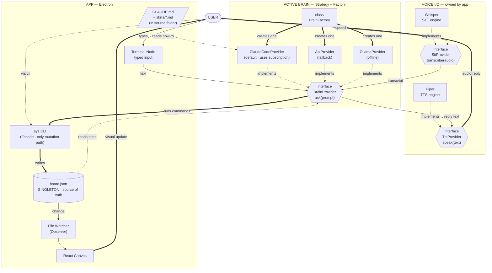

# krnl0 — Canonical Architecture Diagram

*Extracted from PRD v0.6.0 §5*

This is the authoritative system diagram. Every architectural decision flows from this picture.

---

## Reading the diagram

**Bold arrows (`==>`)** — the primary data flow. User input → Brain → `sys` → `board.json` → Canvas → User.

**Thin arrows (`-->`)** — secondary flow. File change notification, text to TTS.

**Dotted arrows (`-.->`)** — read-only access. Brain reads `board.json` and `CLAUDE.md` for context. Providers implement interfaces.

**Subgraph boundaries** — each box is a layer boundary. No arrows cross layers except through the defined interfaces.

---

## The twelve-step voice turn

One voice interaction, fully traced:

1. User holds the orb → app captures mic audio to buffer
2. User releases → buffer passed to `SttProvider.transcribe()`
3. Whisper subprocess returns transcript → caption appears under orb
4. App constructs `BrainContext` (loads `board.json`, attaches paths)
5. App calls `BrainProvider.ask(transcript, context)` → orb turns rust ("thinking")
6. `ClaudeCodeProvider` spawns `claude -p` in the codebase folder
7. Claude Code reads `CLAUDE.md` and live `board.json`
8. Claude Code decides on actions → runs via Bash: e.g., `sys todo add "call mom"`
9. `sys` validates → writes `board.json` → exits 0
10. *(parallel)* File watcher fires → canvas re-renders → todo appears with acid-green pulse
11. Claude Code prints reply to stdout → process exits
12. App calls `TtsProvider.speak()` → Piper plays it → caption fades in → orb returns idle

Three things visible to the user (transcript, canvas update, voice reply). Nine plumbing steps.
