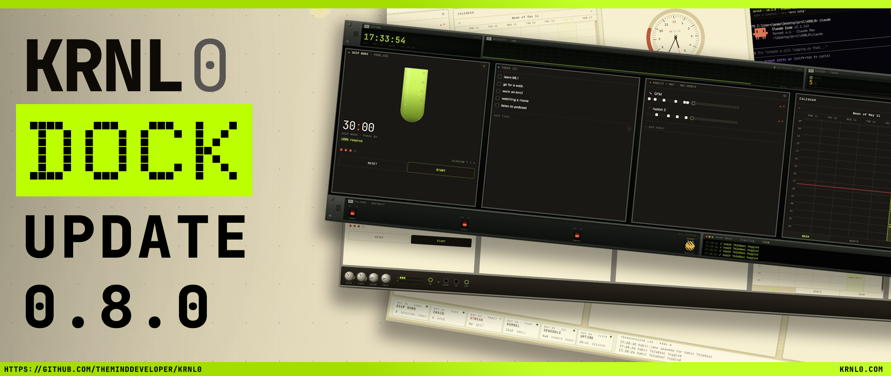

# v0.8.5 — KRNL Dock + first packaged release line



This is the first release line of KRNL0 distributed as a **macOS Apple-Silicon DMG** and a **Windows x64 installer**. It bundles every feature merged since v0.7.0 plus the entire 0.8.x packaging-hardening series (0.8.0 → 0.8.5).

> **Heads-up:** v0.8.5 supersedes v0.8.0–v0.8.4. Uninstall any earlier 0.8.x build before installing v0.8.5 so the Windows installer doesn't reuse cached binaries.

---

## Highlights

### KRNL Dock — chassis variants
The mother row now lives inside a chassis with three switchable looks: **Synthesizer**, **Telemetry**, and **KRNL Dock**. Telemetry is the default. Switching variants shrinks/grows the rack to the bounding box of visible mothers.

- Wired-up Telemetry chrome: mission clock, signal waveform (live from event log), carrier MHz (nodes·edges), sys pressure (completion ratio), downlink (best habit streak), per-mother bays, AOS/LOS, transmission log
- Light-mode polish for all three chassis; `backdrop-filter` dropped where it darkened the rails

### Clock — radial schedule visualisation
Major redesign of how scheduled work is shown on the clock face.

- Train-track lanes per overlapping-task lane (Apple-Fitness-style concentric rings)
- AM/PM toggle bar above the face; 12h-mode toggle in chassis
- Glassy liquid-glass arcs with transparent break overlays (no more melty glow)
- Now-pointer crossing the entire track band; tighter alignment to clock edge
- Day selector — view scheduled tasks/habits for *any* day, not just today
- Scheduled habits surface alongside tasks; JetBrains body font

### Decision 28 — Task kind discriminator
Tasks now carry a `kind` of `focus` or `event`.
- Focus tasks: Pomodoro splits long plannedMin into sessions + breaks (visualised as worm-with-break overlays on the clock and calendar)
- Event tasks: single block, no break, no pomo loop
- Pomo header pill toggles between POMO and EVENT; the active task auto-clears from the timer if the user flips kind mid-session
- ADR recorded in `docs/03-adr/0007-pomodoro-task-kinds-and-contrast-pass.md`

### Decision 29 — CLI extension surface
The `krnl` CLI now covers the full surface a Claude Code session needs to drive KRNL0 from the terminal.

- Task: `kind`, `note`
- Habit lifecycle: `add`, `toggle`, `mark-done`, `remove`, `archive`
- Frames: `frame.add`, `frame.setSize`, `--near` chain walk
- Analytics: `analytics.totals`, `analytics.streaks`, `analytics.open`
- Log: `log.recent`, `log.tail`
- Theme: `theme.get`
- `claude/CLAUDE.md` rewritten and Skills added so the in-app Claude actually knows how to use these

### Analytics — pluggable engine + dashboard
- New `AnalyticsNode` mother with charts (#134)
- Per-day totals, open counters, streaks computed from the event log + board state
- Wired to Telemetry chrome cells
- Chart label colours brightened for legibility on the rust/acid background

### Ambient Radio — favourites + YouTube
- Star YouTube videos to replay without retyping the URL
- Six synthesised presets (Dark, Rain, Fire, Synth, White, Brown) plus a YouTube layer

### Assistant Orb — tutorial flow
- Pomodoro & Tasks tutorial with voice-led choreography
- Quick-action buttons trigger pre-recorded voice flows and camera moves
- Default position moved bottom-left, clear of the React-Flow Controls column

### UX polish — proximity handles, trackpad, GPU
- Proximity resize handles on frame/text/image nodes — appear when the cursor approaches the corner instead of always being visible
- Pane context menu (right-click to add nodes anywhere on the canvas)
- Trackpad zoom + pan gestures wired up; mouse-wheel zooms again
- Connectors auto-hide on text / image / frame nodes until hovered
- macOS chrome fixes; Windows `.ico` taskbar icon

### Contrast pass
- Dark-on-bright text locked everywhere; calendar legend added
- Habit/Todo body copy fixed on bright backgrounds
- Dark-mode "done" check resolved
- Orphan habit-lane cards auto-clean when the source habit is deleted

---

## Packaging — what 0.8.0 → 0.8.5 actually fixed

The v0.8 series shipped a new GitHub Actions release pipeline. Each patch release fixed one packaging gotcha that only surfaced once the binaries were on a real installed machine.

| Version | What it fixed |
|---|---|
| **0.8.0** | First CI release pipeline: `macos-14` (arm64 DMG) + `windows-latest` (NSIS .exe). Auto-uploads to draft GitHub Release on `v*` tag push. |
| **0.8.1** | `bin/krnl-init.ps1` (and `krnl.js` / `sys.js`) weren't in the package — `electron-builder` `files` glob missed `bin/`. Terminal opened with `PowerShell -File <missing>.ps1` and errored. Fix: add `bin/**/*` to the glob. |
| **0.8.2** | YouTube embed silently broken in the EXE. First attempt: serve renderer over custom `krnl-app://` scheme so origin isn't `file://`. *(Insufficient — see 0.8.3.)* |
| **0.8.3** | Real fix for YouTube: spin up a 127.0.0.1-only loopback HTTP server in main process, load renderer at `http://127.0.0.1:<port>/`. YouTube's iframe rejects every non-`http(s)` parent, so a custom scheme wasn't enough; a real HTTP origin works. |
| **0.8.4** | Claude Code inside the terminal didn't know it was in KRNL0 — `claude/CLAUDE.md` was inside `app.asar` (a single archive file), so PowerShell couldn't read it. Fix: `asarUnpack: ["claude/**/*"]` extracts it to a real on-disk sibling; main rewrites `\app.asar\` → `\app.asar.unpacked\` in `$KRNL0_CLAUDE_HOME` before exporting it to the shell. |
| **0.8.5** | Adds GPU compositing flags (`enable-zero-copy`, `enable-gpu-rasterization`, Metal on macOS), Windows taskbar `.ico` resolver, plus everything merged in PRs #151–#155 (terminal renderer stability, claude-wrapper picks `.cmd` shim, canvas mouse-wheel zoom restored, cleaner AI-spawned layouts, clock day selector). |

### Also fixed along the way (and worth knowing)

- `electron` was in `dependencies` — electron-builder rejects that. Moved to `devDependencies` (0.8.0 hotfix)
- Empty repo secrets render as `""`, not unset — electron-builder treated `CSC_LINK=""` as "user supplied a cert" and crashed. Workflow now strips empty CSC env vars at runtime
- 8 `exactOptionalPropertyTypes` typecheck errors and 1 dead-code error pre-existing on main were resolved so CI typecheck goes green

---

## Install

**macOS (Apple Silicon):**
1. Download `krnl0-0.8.5-arm64.dmg` from the Assets section below
2. Open the DMG, drag KRNL0 to Applications
3. First launch: Right-click → Open (the build is unsigned; macOS Gatekeeper prompts once)

**Windows (x64):**
1. Uninstall any older 0.8.x via Settings → Apps if installed
2. Download `krnl0-Setup-0.8.5.exe`
3. Run the installer. SmartScreen warns on first launch (unsigned build); click "More info" → "Run anyway"

---

## How to trigger the release pipeline manually

The workflow is in `.github/workflows/release.yml`. Two ways to start a build:

### Option A — Push a `v*` tag (normal release path)

```bash
git checkout main
git pull
git tag v0.8.6
git push origin v0.8.6
```

The push fires the workflow automatically. Both matrix jobs (mac-arm + win-x64) run in parallel. When they finish, a **draft** GitHub Release is created with the DMG and EXE attached. You edit the notes, drag in screenshots, click Publish.

### Option B — Manual dispatch from the GitHub UI

Go to **github.com/theMindDeveloper/KRNL0/actions → Release** workflow → **Run workflow** button (top right of the run list).

You'll see one input: **`draft`** — defaults to `true`. Leave it as `true` for safety.

This path is useful when:
- You want to re-run the build for an existing tag (e.g. CI was flaky)
- You want to test the pipeline without bumping a version
- You want a one-off build of `main` without tagging it

### Other useful commands

```bash
# Watch a running build from the terminal
gh run watch                          # interactive picker
gh run list --workflow=release.yml   # last few runs
gh run view <run-id>                  # details for one run

# Re-tag (if a tag points to the wrong commit)
git tag -d v0.8.6                     # delete locally
git push origin :refs/tags/v0.8.6     # delete on remote
git tag v0.8.6                        # recreate on current HEAD
git push origin v0.8.6                # push

# Cancel a running build
gh run cancel <run-id>
```

### Signing (optional, for the future)

The workflow auto-detects code-signing secrets. To produce signed builds, add these as repo secrets in **Settings → Secrets and variables → Actions**:

| Secret | What it is |
|---|---|
| `MAC_CSC_LINK` | Base64 of your Apple Developer ID `.p12` cert |
| `MAC_CSC_KEY_PASSWORD` | Password for the `.p12` |
| `APPLE_ID` | Apple ID used for notarisation |
| `APPLE_APP_SPECIFIC_PASSWORD` | App-specific password from appleid.apple.com |
| `APPLE_TEAM_ID` | 10-char team id from developer.apple.com |
| `WIN_CSC_LINK` | Base64 of your Authenticode `.pfx` cert |
| `WIN_CSC_KEY_PASSWORD` | Password for the `.pfx` |

When any are present the workflow signs and (for macOS) notarises automatically. When none are present it produces unsigned binaries (current state).

---

## Full commit list since v0.7.0

Run locally to see the full set:

```bash
git log v0.7.0..v0.8.5 --oneline --no-merges
```

Highlights are above. Notable user-facing commits:

- `feat(canvas)`: cleaner AI-spawned layouts + tighter inference scope
- `feat(clock)`: day selector, train-track lanes, AM/PM bar, JetBrains font
- `feat(schedule)`: break-aware focus-task visualisation (Decision 28 PR-B)
- `feat(task)`: kind discriminator + UX gates (Decision 28 PR-A)
- `feat(cli)`: extend surface — task kind/note, habit lifecycle, frames, analytics, log, theme (Decision 29)
- `feat(radio)`: star YouTube videos to replay
- `feat(ux)`: proximity resize handles, pane context menu, trackpad & GPU polish
- `feat(analytics)`: pluggable engine + AnalyticsNode dashboard (#134)
- `feat(chassis)`: wired-up dock variants + light-mode polish
- `feat(assistant)`: Pomodoro & Tasks tutorial, music choreography
- `fix(terminal)`: claude wrapper picks `.cmd` shim, renderer-before-open eliminates TUI drift, process.env check dropped
- `fix(canvas)`: mouse-wheel zooms again, frame proximity handle, clear-dock spawn
- `fix(clock)`: dozens of polish commits — track radii, glass arcs, break overlays
- `fix(habit+todo)`: contrast on bright bg, orphan-lane auto-clean

Plus the entire packaging-hardening series detailed in the table above.
