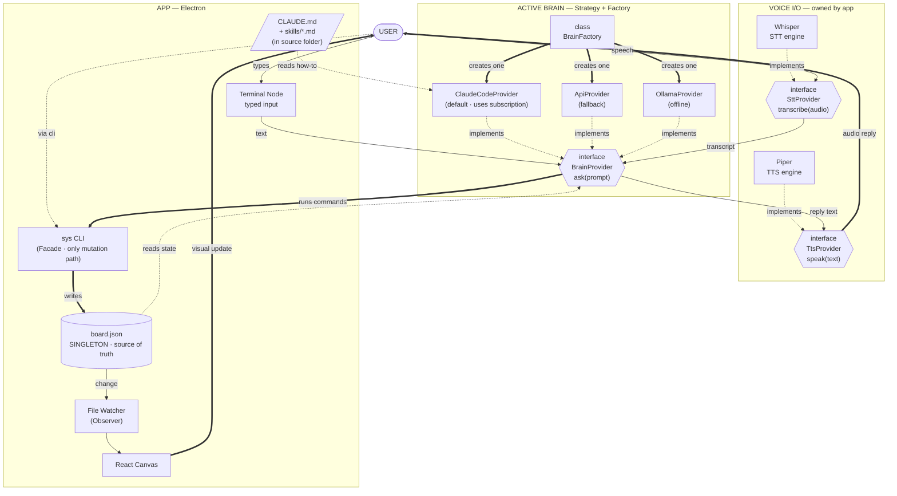

# krnl0 — Product Requirements Document

*v0.6.0 · May 9, 2026 · Architecture Locked · Ready for Build*

---

## 0. Status of this document

This is the canonical PRD. It supersedes v0.4.2 and v0.5.0. Every architectural decision in this document is locked. From here, code follows the doc; if a decision needs to change, the doc changes first.

The major shifts since v0.4.2:

| Decision | v0.4.2 | v0.6.0 (locked) |
|---|---|---|
| Plugin architecture | Core feature | **Cut.** Built-in nodes only. |
| Node types in v1 | 6+ | **3 anchored mothers + Terminal.** Journal v1.5. |
| Node placement | Free | **Mothers anchored. Children free.** |
| Desktop app | "v2 / browser-first" | **v1. Electron.** |
| Tech stack | Open | **Electron + TypeScript (strict) + React + Zustand + Zod.** |
| AI | Vague "Claude Code" | **Three-layer architecture: Voice I/O + Brain (Strategy) + Action (`sys`).** |
| Brain | Single | **Swappable via BrainProvider interface. Default: Claude Code subprocess. Fallback: API. Offline: Ollama.** |
| Voice | Not in scope | **Whisper STT + Piper TTS, both local.** |
| Source of truth | Vague | **`board.json` — singleton, watched by file observer.** |
| Sync / multiplayer / mobile / themes | In or out | **All cut.** |

---

## 1. What it is

**krnl0** is a voice-driven canvas for personal planning. Three anchored widgets — Pomodoro, Todos, Habits — sit at fixed positions on a paper-toned canvas. A terminal node sits beside them as a fourth peer. A floating orb is the AI assistant. You can click and type, or you can press the orb and talk: *"plan a two-hour deep-work block on the thesis, then a walk."* The assistant transcribes your speech, decides what to do, runs commands against the same `sys` CLI a power user would type by hand, the canvas redraws to show the new pipeline, and the assistant reads back what it did.

The product is a Natural User Interface demo. The voice flow is the embodied-input demonstration. The canvas is the visible system the voice produces. The terminal proves that everything voice can do, the keyboard can do too — same surface, different mouth.

> **One canvas. Talk to it. Yours to own.**

---

## 2. Three convictions (preserved)

1. **Visible systems beat invisible ones.** Connections between nodes are rendered. Event flow is observable. Your setup is on the canvas, not buried in settings.
2. **The terminal is a peer, not an escape hatch.** Every GUI capability is reachable through `sys`. If `sys` can't do it, voice can't do it, and AI can't drive it.
3. **AI wires, it does not replace.** The assistant operates the same surface a user has — `sys` commands, `board.json`, `CLAUDE.md`. No backdoor, no privileged API.

---

## 3. Academic context

This is the deliverable for HTW Berlin's *Natural User Interfaces* course, theme **Inclusive Design**.

### Deadlines

| Date | Deliverable |
|---|---|
| 06 Jun 2026 | 5-min progress presentation |
| 02 Jul 2026 | 5-min progress presentation |
| **20 Jul 2026** | **15-min final presentation + live demo** |
| 03 Aug 2026 | Written documentation submission |

≈10 weeks to the live demo. Solo developer learning TypeScript while building. Scope is sized for that reality (§14).

### Evaluation map (100 pts)

| Criterion | Pts | Where in this PRD |
|---|---|---|
| Interaction Design & Heuristic Evaluation | 20 | §12, §13 (R10 inclusive design) |
| Fulfilled Requirements | 20 | §13 |
| Concept & Design Process | 15 | Separate sketches + lo-fi prototype deliverable |
| Presentation & Delivery | 15 | §14 demo plan |
| Documentation | 10 | This doc + README + code comments |
| Development Process | 10 | Git, issue tracker, weekly self-review |
| System Diagram | 5 | §5 (canonical Mermaid) |
| Research & References | 5 | §16 |

### Inclusive design framing

Three modalities, one model underneath. Each is testable separately and explicit in §13:

- **Voice / low-vision / motor-limited users** drive the app by speaking to the orb.
- **Visual / motor users** drive the canvas with mouse and keyboard.
- **Power users** drive the terminal node directly with `sys` commands.

All three converge on the same `sys` surface, the same `board.json`, the same canvas. That convergence is the inclusive-design story.

---

## 4. Architectural shape — three layers

The system is three loosely coupled layers. Each layer talks to the next through an explicit interface. No layer reaches across.

```
┌─────────────────────────────────────────────────────────────────┐
│ LAYER 1 — VOICE I/O                                             │
│   SttProvider (Whisper)        TtsProvider (Piper)              │
│   audio in → text              text → audio out                 │
└────────┬─────────────────────────────────────▲──────────────────┘
         │ transcript                          │ reply text
         ▼                                     │
┌─────────────────────────────────────────────────────────────────┐
│ LAYER 2 — BRAIN (Strategy)                                      │
│   BrainProvider interface                                       │
│     ├── ClaudeCodeProvider  (default — `claude -p` subprocess)  │
│     ├── ApiProvider         (fallback — HTTPS to api.anthropic) │
│     └── OllamaProvider      (offline — local LLM)               │
│   BrainFactory selects one at startup based on settings.        │
└────────┬─────────────────────────────────────▲──────────────────┘
         │ runs sys commands                   │ reads context
         ▼                                     │
┌─────────────────────────────────────────────────────────────────┐
│ LAYER 3 — ACTION & STATE                                        │
│   sys CLI (Facade) ── writes ──▶ board.json (Singleton)         │
│                                       │                         │
│   File watcher (Observer) ◀── change ──┘                        │
│                  │                                              │
│                  ▼ notifies                                     │
│   Canvas (React) re-renders                                     │
│                                                                 │
│   Static instructions: CLAUDE.md, skills/*.md (in source)       │
└─────────────────────────────────────────────────────────────────┘
```

This is the spine. Every other architectural decision serves it.

---

## 5. Canonical architecture diagram



---

## 6. Design patterns map

This section names every pattern used and where it lives. The diagram above is the structural view; this is the rationale.

### 6.1 Strategy + Provider

**Used for:** the Brain, STT, and TTS — anywhere we want one interface with multiple swappable implementations.

```typescript
// LAYER 2 — Brain
interface BrainProvider {
  /** Send a prompt; receive a reply. The implementation may run
      shell commands, call an API, or invoke a local model. */
  ask(prompt: string, context: BrainContext): Promise<BrainReply>;
}

class ClaudeCodeProvider implements BrainProvider {
  async ask(prompt: string, ctx: BrainContext): Promise<BrainReply> {
    // spawns: claude -p "<prompt>" --output-format json
    //         --allowedTools "Bash,Read,Edit,Write"
    // captures stdout, parses .result
  }
}

class ApiProvider     implements BrainProvider { /* HTTPS to Anthropic */ }
class OllamaProvider  implements BrainProvider { /* spawns ollama run */ }

// LAYER 1 — Voice I/O
interface SttProvider { transcribe(audio: Buffer): Promise<string>; }
interface TtsProvider { speak(text: string): Promise<void>; }

class WhisperProvider implements SttProvider { /* whisper.cpp subprocess */ }
class PiperProvider   implements TtsProvider { /* piper subprocess */ }
```

The rest of the app holds only the interfaces. The concrete classes are unknown to it.

### 6.2 Factory

**Used for:** producing the active Brain at startup based on user settings.

```typescript
class BrainFactory {
  static create(settings: BrainSettings): BrainProvider {
    switch (settings.kind) {
      case "claude-code": return new ClaudeCodeProvider(settings.cliPath);
      case "api":         return new ApiProvider(settings.apiKey);
      case "ollama":      return new OllamaProvider(settings.modelName);
    }
  }
}
```

Runs once at app startup or when the user changes their brain choice in settings. Per voice turn, the app calls `brain.ask()` on the already-constructed instance — the Factory does not run per turn.

### 6.3 Facade

**Used for:** `sys` CLI itself, and the `NodeKernel` inside the app.

`sys` is one external command. Behind it sit several internal steps: parse arguments, validate via Zod, locate the right node, dispatch the right command handler, mutate the store, persist to disk, return a result. Callers (GUI buttons, voice flow, Claude Code subprocess) see one entry point. None of them depend on the steps inside.

```typescript
class SysFacade {
  async run(argv: string[]): Promise<SysResult> {
    const command = SysParser.parse(argv);
    const result  = await this.kernel.dispatch(command);
    await this.persistence.save(this.kernel.board);
    return result;
  }
}
```

### 6.4 Observer

**Used for:** detecting changes to `board.json` and notifying the canvas.

```typescript
class BoardWatcher {
  constructor(private path: string) {}
  subscribe(listener: (board: Board) => void): Unsubscribe {
    return fs.watch(this.path, async () => {
      const board = await Persistence.load(this.path);
      listener(board);
    });
  }
}
```

The Canvas subscribes once at mount. Every time `sys` writes the file, the canvas re-renders.

A second use of Observer: Zustand's store subscriptions. UI components subscribe to slices of state. When a slice changes, only that component re-renders. This is "free" — Zustand provides it.

### 6.5 IBoundary (Renderer ↔ Main)

**Used for:** the seam between Electron's renderer process (UI) and main process (filesystem, subprocesses, OS access).

```typescript
interface IBoundary {
  loadBoard(): Promise<Board>;
  runSys(argv: string[]): Promise<SysResult>;
  askBrain(prompt: string): Promise<string>;
  startListening(): Promise<void>;
  stopListening(): Promise<string>; // returns transcript
  speak(text: string): Promise<void>;
}

// Real implementation routes calls through Electron IPC.
class IpcBoundary implements IBoundary {
  loadBoard() { return ipcRenderer.invoke("board:load"); }
  // ...
}

// Mock implementation returns fake data — used in tests and Storybook.
class MockBoundary implements IBoundary {
  async loadBoard() { return { /* fixture */ }; }
  // ...
}
```

The UI **never** imports from `electron`, `fs`, `child_process`, or any other system module directly. It depends on `IBoundary`. This is what makes the UI testable without an OS underneath.

### 6.6 Dependency Injection

**Used everywhere.** No class instantiates its dependencies; they are passed in.

```typescript
class VoiceTurn {
  constructor(
    private stt: SttProvider,
    private brain: BrainProvider,
    private tts: TtsProvider
  ) {}

  async run(audio: Buffer): Promise<void> {
    const text  = await this.stt.transcribe(audio);
    const reply = await this.brain.ask(text, this.gatherContext());
    await this.tts.speak(reply.text);
  }
}
```

`VoiceTurn` has zero dependency on Electron, Whisper, or Claude Code. Tested with three mocks, all unit-level. This is the test of correctness for the architecture: can the orchestrator be tested without spinning up real subprocesses? If yes, the seams are right.

### 6.7 Singleton

**Used for:** `board.json` (the file) and the in-memory `BoardStore` that mirrors it. There is exactly one. This is enforced by convention and by passing the same store reference everywhere via DI — not by static state.

### 6.8 Component isolation

Modules expose only their public interface. Internal helpers stay internal. No two-way imports between sibling modules. The dependency graph is strictly downward: UI → IBoundary → main process services → providers → external systems.

### 6.9 Mocking strategy

Three flavors:

- **Unit-level mocks** — implement `BrainProvider`, `SttProvider`, etc., with deterministic fakes. Used in Jest tests.
- **`MockBoundary`** — full IBoundary implementation with in-memory state. Used to run the UI in Storybook or with Vitest UI.
- **Integration tests** — real `sys` CLI, real `board.json` in a temp directory, real file watcher. No real Whisper / Claude Code (too slow, too flaky for CI).

---

## 7. The node system

### 7.1 Mother and child

**Mother nodes** are anchored at fixed canvas coordinates. Cannot be dragged or deleted. The user pans past them but can always recenter (`Home` key).

| Mother | `kind` | Position | Role |
|---|---|---|---|
| Pomodoro | `pomo` | `(0, 0)` | Focus timer + session log |
| Todos | `todo` | `(-480, 0)` | Active task list |
| Habits | `habit` | `(480, 0)` | 7-day grid + streaks |
| Terminal | `term` | `(0, 320)` | `sys` CLI host |

Camera centers on `(0, 160)` at startup so all four are visible.

**Child nodes** are spawned by mothers, by the user, or by the assistant. Free to drag, delete, connect. Examples: a `pomo.session` (one focus block), a `todo.task` (one task), a `habit.day` (one completion record).

### 7.2 The Node contract

Every node — mother or child — is the same shape:

```typescript
interface Node<TState = unknown, TConfig = unknown> {
  id: string;                          // ULID
  kind: string;                        // "pomo", "todo.task", ...
  position: { x: number; y: number };
  state: TState;                       // serializable JSON
  config: TConfig;                     // user-editable settings
  isMother: boolean;
}

interface NodeKind<TState, TConfig> {
  kind: string;
  defaultState: () => TState;
  defaultConfig: () => TConfig;
  render: (props: RenderProps<TState, TConfig>) => ReactElement; // pure
  commands: Record<string, CommandHandler<TState>>;
  events: readonly string[];
  schema: ZodSchema<TState>;
}
```

Six rules, none of which bend:

1. **State is JSON-serializable.** No functions, no class instances, no DOM, no closures.
2. **Render is pure.** Same state + config → same UI. Side effects belong in command handlers.
3. **Commands mutate state.** Every state change goes through a named command. No direct setState.
4. **Events are typed strings the node emits.** They're the connection points for edges.
5. **Cross-node logic only through edges.** No two node modules import each other. Ever.
6. **No node has privileged access.** Mothers use the same APIs as children. "Anchored, can't delete" is enforced by the kernel, not by the mother nodes.

### 7.3 Edges

```typescript
interface Edge {
  id: string;
  from: { nodeId: string; event: string };
  to:   { nodeId: string; command: string };
  args?: Record<string, unknown>;
  enabled: boolean;
}
```

Edges are data, stored in `board.json`. The kernel maintains an edge table. When a node emits an event, the kernel dispatches matching edges. Active edges glow acid-green for ~600ms, then fade.

Three ways to create an edge:
- Drag from output port to target node.
- Voice: *"when I finish a Pomodoro, mark deep-work done"*.
- CLI: `sys edge add --from pomo:onComplete --to habit:markDone --args habit=deep-work`.

### 7.4 Persistence rule — persist intent, derive presentation

A running Pomodoro is not saved tick-by-tick. Saved:

```json
{
  "kind": "pomo",
  "state": {
    "currentSession": {
      "id": "01HX...",
      "startedAt": "2026-05-09T14:32:00Z",
      "durationMin": 25,
      "label": "thesis writing",
      "status": "running"
    },
    "history": [ /* completed sessions */ ]
  }
}
```

The countdown displayed on screen is computed every render from `now() - startedAt`. Close the app for 5 minutes, reopen — timer correctly shows the right elapsed value. Same rule for habits (store completion log, derive "is today done") and edges (store wiring, derive activity).

### 7.5 Board file format

```
~/Documents/the-system/        ← user data folder
├── board.json
└── notes/                     ← markdown sidecars (Journal v1.5)
    └── journal-2026-05-09.md
```

```json
{
  "version": 1,
  "schemaVersion": 1,
  "savedAt": "2026-05-09T15:00:00Z",
  "viewport": { "x": 0, "y": 160, "zoom": 1 },
  "nodes": [ /* Node[] */ ],
  "edges": [ /* Edge[] */ ]
}
```

**Round-trip contract:** load → save → byte-identical (modulo `savedAt`). Tested.

The codebase, separately, contains:

```
/the-system/                   ← app source folder (git repo, ships in installer)
├── src/                       ← TypeScript code
├── claude/
│   ├── CLAUDE.md              ← instructions Claude Code reads on every turn
│   └── skills/
│       ├── plan-session.md
│       └── wire-edge.md
└── package.json
```

`CLAUDE.md` and `skills/*.md` ship inside the codebase as part of the project (your call — and the right call). The Brain layer points at them by absolute path when spawning Claude Code.

---

## 8. AI architecture in detail

### 8.1 The three layers, rephrased

- **Voice I/O layer** is yours. It owns the mic, the speakers, and the text-text boundary.
- **Brain layer** is swappable. It receives text and a context; it returns text and may execute side effects.
- **Action layer** (`sys` + `board.json`) is yours. It is the only mutation surface.

### 8.2 BrainProvider interface

```typescript
interface BrainContext {
  boardSnapshot: Board;        // current state, JSON
  instructionsPath: string;    // path to CLAUDE.md
  skillsPath: string;          // path to skills/
  workingDir: string;          // where to spawn the subprocess
}

interface BrainReply {
  text: string;                // what the assistant says back
  durationMs: number;
  commandsRun?: string[];      // for logging only
}

interface BrainProvider {
  ask(prompt: string, context: BrainContext): Promise<BrainReply>;
}
```

The interface is small on purpose. Anything more (tool definitions, streaming, conversation history) is the implementation's concern, not the contract's.

### 8.3 ClaudeCodeProvider — the default

How it works concretely:

```bash
# Spawned per voice turn, fresh subprocess
claude -p "<user transcript>" \
  --output-format json \
  --allowedTools "Bash,Read,Edit,Write" \
  --append-system-prompt "You are the assistant for krnl0..."
# CWD = the codebase folder, where CLAUDE.md lives
```

Claude Code reads `CLAUDE.md` from its working directory automatically. That file teaches it:
- What krnl0 is.
- That the user data lives at `~/Documents/the-system/board.json`.
- That mutations happen through `sys <subcommand>` (the CLI, available on PATH).
- Common patterns and example sessions (see `skills/*.md`).

Claude Code then uses its Bash tool to run `sys` commands, its Read tool to inspect `board.json`, and writes a final reply to stdout. The Provider parses the JSON output, extracts `.result`, returns it as `BrainReply.text`.

**Latency:** ~1-2 seconds startup overhead per fresh subprocess + Claude Code's own response time. Acceptable for v1. A v1.1 optimization is to keep one Claude Code session alive across turns using `--resume <session_id>` — faster and gives the assistant memory of the last few turns.

**Authentication:** uses the user's existing Claude Code login on their machine. No API key entry required, no charges to the user beyond their existing subscription.

### 8.4 ApiProvider — the fallback

Direct HTTPS calls to `api.anthropic.com`. User pastes their own Claude API key on first run. The Provider builds a system prompt that mirrors `CLAUDE.md` (read from the same file at startup), includes the board snapshot, defines tool schemas matching `sys` commands, calls the Messages API with tool use, and executes returned tool calls against `sys`.

This is the brain Anthropic users without Claude Code installed will reach for. Cost: ~$0.003 per turn.

### 8.5 OllamaProvider — offline option

Spawns `ollama run gemma2:2b` (or similar). Pipes the prompt — system message + transcript + board snapshot — via stdin. Parses freeform reply text for embedded `sys` commands using a strict format taught in the system prompt (e.g., lines starting with `RUN: sys ...`). Less reliable than Claude/API for fuzzy intent, but acceptable for direct commands and 100% local.

### 8.6 Voice providers

```typescript
class WhisperProvider implements SttProvider {
  // Spawns whisper.cpp with the base.en model (~140MB)
  // CPU-only, ~300ms for 5s of audio on a modern laptop
  async transcribe(audio: Buffer): Promise<string> { /* ... */ }
}

class PiperProvider implements TtsProvider {
  // Spawns piper with a chosen voice model
  // Good quality, free, fully local
  async speak(text: string): Promise<void> { /* ... */ }
}
```

Both are subprocess-based. Both run fully local. No network, no API keys, no costs.

### 8.7 The voice turn — twelve steps

For reference, this is what one voice interaction looks like end to end:

1. User holds the orb. App captures mic audio to a buffer.
2. User releases. App passes the buffer to `SttProvider.transcribe()`.
3. Whisper subprocess returns a transcript. Caption appears under the orb.
4. App constructs `BrainContext` (loads `board.json`, attaches paths).
5. App calls `BrainProvider.ask(transcript, context)`. Orb turns rust ("thinking").
6. ClaudeCodeProvider spawns `claude -p` in the codebase folder.
7. Claude Code reads `CLAUDE.md` and the live `board.json`.
8. Claude Code decides on actions, runs them via Bash: e.g., `sys todo add "call mom"`.
9. `sys` validates, writes `board.json`, exits with code 0.
10. *In parallel:* the file watcher inside the app fires; the canvas re-renders; the new todo appears with an acid-green edge pulse.
11. Claude Code prints final reply to stdout: `"Added 'call mom' to your todos"`. Process exits.
12. App captures reply, calls `TtsProvider.speak()`, Piper plays it. Caption above orb fades in. Orb returns to idle.

Three things visible to the user (transcript caption, canvas update, voice reply). Nine plumbing.

---

## 9. The `sys` CLI

The command surface. Single mutation path. Tested.

```
sys board show
sys board save / load <path>

sys node list
sys node add <kind> [--at x,y] [--parent id] [--state json]
sys node remove <id>

sys pomo start [--label "..."] [--minutes 25]
sys pomo stop
sys pomo status

sys todo add "..." [--tag work]
sys todo check <id>
sys todo list

sys habit add "<name>"
sys habit done <name> [--date 2026-05-09]
sys habit streak <name>

sys edge add --from <node:event> --to <node:command> [--args k=v]
sys edge remove <id>
sys edge list

sys say "..."     # speak via TTS — for testing voice path
sys hear          # one-shot transcribe — for testing STT path
```

Every command supports `--json` for machine-readable output. Every command's parser is unit-tested.

---

## 10. Tech stack — locked

| Concern | Choice | Why |
|---|---|---|
| Desktop shell | **Electron** | One language end-to-end. Massive ecosystem. Boring and proven. ~150MB binary acceptable for desktop productivity app. |
| Language | **TypeScript strict** | Real interfaces, generics, access modifiers. Same patterns as Java but better ecosystem. No `any` allowed. |
| UI library | **React** | Best documentation surface. Best AI-assist coverage. Component model fits the Node contract. |
| State | **Zustand** | Single store, minimal boilerplate, TS-native, observer subscriptions baked in. |
| Validation | **Zod** | Every boundary that touches disk, network, or user input. Especially `board.json` loader. |
| Canvas rendering | **DOM nodes + SVG edges** | Fast enough at 100-node scale. Free accessibility, theming, focus, dev tools. |
| Storage | **Filesystem** | One JSON file in user documents folder. No SQLite, no IndexedDB. |
| Package manager | **npm** | Same role as `pip` or Maven. Standard. |
| STT | **Whisper (local)** via `whisper.cpp` | Free, private, fast on CPU. |
| TTS | **Piper (local)** | Free, decent quality, fully offline. |
| Brain (default) | **Claude Code** subprocess | User's existing subscription, no extra cost, autonomous tool use. |
| Brain (fallback) | **Anthropic API** with BYOK | For users without Claude Code. |
| Brain (offline) | **Ollama** local LLM | Privacy / offline path. |
| Testing | **Vitest** + **React Testing Library** | Fast, TypeScript-native. |

Things explicitly not in the stack: Tauri (Rust learning curve), Canvas/WebGL (overkill), Redux (boilerplate), SQLite (overkill), Sesame (no public API), OpenAI Realtime (cost), MCP server (v1.1 polish).

---

## 11. Visual system (preserved from v0.4.2)

### 11.1 Tokens

| Token | Light | Dark | Role |
|---|---|---|---|
| `--paper` | `#f5f1e8` | `#0e0d0b` | Canvas background |
| `--paper-2` | `#ede7d6` | `#1a1814` | Subtle fills, node body |
| `--paper-3` | `#e3dcc7` | `#2a2620` | Borders, dividers |
| `--ink` | `#1a1814` | `#f0ebdd` | Primary text |
| `--ink-3` | `#6b6354` | `#8a8270` | Secondary text |
| `--acid` | `#c9f158` | `#c9f158` | Active connections, terminal accent, voice "listening" |
| `--rust` | `#c8553d` | `#e87a5f` | Pomodoro, warnings, "thinking" |
| `--term-bg` | `#0c0a08` | `#05040a` | Terminal — always dark in both themes |

### 11.2 Typography

| Role | Font |
|---|---|
| Chrome, code, headers | JetBrains Mono |
| Body | Geist |
| Prose | Instrument Serif |

### 11.3 Layout principles

1. Monospace grid: 32px minor / 160px major.
2. Signal over decoration. No gradients. No glassmorphism. No emoji icons.
3. Headers monospace, uppercase, dim. No exceptions.
4. Only active connections animate. Acid-green pulse, ~600ms. Everything else still.
5. Terminal always dark — both themes.

---

## 12. Frontend specification

### 12.1 Mother nodes

Larger than children. Pinned-corner glyph (`▙`) in the header. No `×` button — settings gear instead. At far zoom-out they remain labeled blocks (canvas-as-landmark).

### 12.2 Child nodes

Standard anatomy:

```
┌─────────────────────────────┐
│ ● TITLE  kind.tag         × │  ← monospace, uppercase, dim
├─────────────────────────────┤
│                             │
│ node body                   │
│                             │
└─────────────────────────────┘
●                             ●  ← input port (left), output port (right)
```

Spawn near their mother, animate into position once on creation (200ms ease-out), then still.

### 12.3 The orb

Circular button, fixed in viewport (not on canvas), bottom-right, 56px. States:

- **Idle** — acid-green dot inside paper-2 circle, breathing 3s.
- **Listening** — solid acid-green fill, waveform ring from mic level.
- **Thinking** — rust dot, faster pulse, while waiting on the brain.
- **Speaking** — acid-green ring expanding, while TTS plays.

Push-to-talk on `Space`. Click anywhere else to cancel mid-listen. Caption above orb shows live transcript while listening, `…` while thinking, the assistant's reply on completion (5s, fades).

### 12.4 Terminal node

Always dark. macOS three-light titlebar style. JetBrains Mono. Acid-green prompt and output, rust for errors. Built-in commands: `sys`, `help`, `clear`, `ls`, `cat`, `claude <msg>` (one-shot to active brain).

### 12.5 Inclusive design surfaces

Each is testable in lo-fi prototyping:

- **Voice modality** — full app control without keyboard or mouse.
- **Keyboard modality** — every action mapped to a shortcut. Tab order across nodes.
- **Visual modality** — spatial canvas. Color is never the only signal — every state change has a shape or text component.
- **Reduced motion** — setting that disables orb breathing, edge pulses, spawn animation.
- **High contrast** — `--high-contrast` variant boosts ink/paper delta.
- **Font scaling** — all sizes from CSS variables.

---

## 13. Ten functional requirements

The course requires ten testable requirements with acceptance criteria. These are the ones we'll demo. Confirm against what was discussed at the May 4 group presentation; replace any that don't match.

| # | Requirement | Acceptance criterion |
|---|---|---|
| R1 | User can create, edit, and complete todos via GUI | Add via button → todo appears in Todo mother. Click checkbox → strikethrough, dim. |
| R2 | User can run a Pomodoro with intent persistence | Start with label. Close + reopen — timer continues from correct elapsed time. |
| R3 | User can track habits across days | 7-day grid. Click cell → state toggles, streak updates. |
| R4 | All GUI actions are reachable via `sys` CLI | Every GUI action documented with CLI equivalent. Spec test verifies. |
| R5 | Two nodes can be wired with an edge | Drag from `pomo:onComplete` to `habit:markDone`. Complete a session — habit cell fills. |
| R6 | User can voice-control the app | Push-to-talk → speak → action executes. ≤3s end-to-end. |
| R7 | The assistant narrates its actions | Every successful turn produces audible reply summarizing change. |
| R8 | The assistant can plan a multi-step session | "Plan a 2-hour deep-work block" → spawns Pomodoro children + edges visibly. |
| R9 | Board persists losslessly across restarts | Save → close → open → byte-identical state, including mid-session. |
| R10 | App is fully operable without mouse OR without keyboard | Two flows: voice-only and keyboard-only, each completes a full session. |

R10 is the inclusive-design requirement and the strongest answer to the course theme.

---

## 14. Phased roadmap

10 weeks to live demo. Solo. Learning TypeScript. Order matters; weeks build on each other.

### Week 1 (May 9–15) · Setup + kernel
- Electron + React + TypeScript scaffold.
- Token system, fonts, light/dark toggle.
- Zustand store with `Node` and `Edge` types.
- `Persistence.save/load` with round-trip test.
- One placeholder node renders on canvas.

**Demo:** open app, see paper canvas with one square, toggle theme, save & reload.

### Week 2 (May 16–22) · Canvas + mother nodes
- DOM-based pan + zoom canvas.
- Four mother nodes anchored.
- Pomodoro working (with persistence rule).
- Todo: add / check / delete.
- Habit: 7-day grid, tap to toggle.

**Demo:** all four mothers functional. No edges yet.

### Week 3 (May 23–29) · Edges + child nodes
- Edge data model + SVG rendering.
- Edge dispatcher in kernel.
- Drag-to-connect.
- Child node spawning + active-edge pulse.

**Demo:** start Pomodoro → child session appears → drag edge to habit → complete → habit fills.

### Week 4 (May 30 – Jun 5) · Terminal + sys CLI
- Terminal node (xterm.js) with acid-green styling.
- Full `sys` CLI from §9.
- IPC plumbing.
- Parser tests.

**Demo at Jun 6:** every GUI action also doable from terminal.

### Week 5 (Jun 6–12) · Voice STT + brain
- `WhisperProvider` via `whisper.cpp`.
- Push-to-talk on orb (Space).
- `BrainProvider` interface + `ClaudeCodeProvider`.
- `BrainFactory` + settings UI.
- `CLAUDE.md` + initial `skills/`.

**Demo:** press orb, say "add a todo to call mom" → todo appears.

### Week 6 (Jun 13–19) · Voice TTS + reply
- `PiperProvider`.
- Reply narration above orb + TTS.
- Error handling: API failure, mic denied, empty transcription.

### Week 7 (Jun 20–26) · Plan-a-session demo
- Multi-step assistant turns: "plan a 2-hour deep-work session" produces multiple child nodes + edges.
- Visual feedback as nodes appear sequentially.

**Demo at Jul 2:** the Iron Man moment.

### Week 8 (Jun 27 – Jul 3) · Inclusive design + a11y
- Reduced-motion setting.
- High-contrast variant.
- Keyboard navigation throughout.
- Lo-fi heuristic evaluation with 3 testers (course requirement).

### Week 9 (Jul 4–10) · Polish + bug bash
- Visual polish on every node.
- Loading, empty, error states.
- ASCII boot screen on terminal.
- Performance: confirm 60fps with 50+ nodes.

### Week 10 (Jul 11–17) · Demo prep
- Slides for Jul 20.
- Live demo script, rehearsed end-to-end.
- README + inline TSDoc on public APIs.
- Backup video in case live demo fails.

### Buffer (Jul 18 – Aug 3) · Documentation
- Written submission.
- Clean system diagram (export of §5 Mermaid).
- Research & references doc.
- User journey map.
- Heuristic evaluation report.

This schedule has no slack. Every slipped week eats polish. Cut features early — three polished mothers beats four broken ones.

---

## 15. What we explicitly cut

So we don't drift back:

- Plugin system, manifest, sandbox, registry.
- Multiple boards (one in v1).
- Cloud sync, multiplayer.
- Mobile companion.
- Project board node, image node, additional node types.
- Local LLM as default (it's an option, not the default).
- Real-time voice models (OpenAI Realtime, Sesame).
- MCP server (v1.1 polish).
- ElevenLabs (v1.1 opt-in).
- Background tray app.
- Custom themes (token system supports them; we don't ship more than light + dark).
- Web/browser version.

---

## 16. Research & references

For the documentation submission:

1. **Obsidian** — local-first, file-based. Influence: filesystem-as-source-of-truth, markdown sidecars, project-folder-with-CLAUDE.md.
2. **Miro / FigJam** — infinite canvas with edges. Influence: canvas interactions; we diverge by anchoring mother nodes (canvas has a backbone).
3. **Notion** — block-based productivity. Influence: counter-example. Notion buries everything in pages; we surface everything spatially.
4. **Iron Man / J.A.R.V.I.S.** — voice-first ambient assistant. Influence: orb interaction model.
5. **Loop Habit Tracker** — minimalist habit grid. Influence: Habit mother visual density.

Plus academic NUI references from course readings: *Brave NUI World* (Wigdor) and *Where the Action Is* (Dourish).

---

## 17. Open questions for the founder

Decide before week 1 of build:

1. **Solo or team?** Course allows up to 4. PRD assumes solo.
2. **Do the May 4 lecturer-discussed requirements match §13?** If not, replace.
3. **Does the course expect a physical sensor?** Voice qualifies as embodied input under most NUI definitions, but if lecturers expect gesture or depth sensing, we need to add a dedicated sensor surface.
4. **Journal node — v1 or v1.5?** PRD currently defers to v1.5. Including it adds the markdown sidecar story (good for the documentation submission).
5. **First-run flow for Claude Code.** PRD assumes the user has Claude Code installed and logged in. On first launch, if `claude` is missing on PATH, the app should detect this and offer to fall back to API mode with a "paste your key" panel. Decide: ship a graceful fallback, or require Claude Code as a prereq?

---

## 18. Glossary

For terms that came up during planning:

- **Electron** — framework that wraps a web app into a desktop app. VS Code, Slack, Obsidian use it. Has two halves: a *main process* (full OS access) and a *renderer process* (the UI, sandboxed).
- **React** — UI library that runs inside Electron's renderer. Draws the canvas, buttons, orb.
- **TypeScript** — JavaScript with real types and interfaces. Closer to Java than to Python in feel.
- **npm** — Node Package Manager. Like `pip` for Python or Maven for Java.
- **package.json** — file listing your project's dependencies. Like `requirements.txt`.
- **Subprocess** — another program your program runs and captures the output of. `child_process.spawn` in Node.
- **IPC** — Inter-Process Communication. How Electron's main and renderer processes talk to each other.
- **File watcher** — utility that fires an event when a file changes. Implements the Observer pattern.
- **Singleton** — one instance, shared. `board.json` is a singleton in our system.
- **Strategy pattern** — one interface, multiple implementations, swap at runtime. Used for `BrainProvider`.
- **Factory pattern** — class whose only job is producing the right object based on input. Used for `BrainFactory`.
- **Observer pattern** — components subscribe to changes; the source notifies subscribers. Used for the file watcher and the Zustand store.
- **Facade pattern** — one simple interface in front of a complex subsystem. `sys` is a facade.
- **Dependency Injection** — passing dependencies in instead of `new`-ing them inside a class. Makes testing trivial.
- **Mock** — a fake implementation of an interface used in tests. Replaces real subprocesses, network calls, file I/O.
- **Interface** — a contract that says "anything that has these methods can be used here." TypeScript supports them natively.
- **Round-trip** — saving and re-loading produces the same data. The test that proves persistence works.
- **Persist intent, derive presentation** — store only what can't be recomputed; recompute everything else on the fly.

---

*One canvas. Talk to it. Yours to own.*
*Architecture locked. Build starts week 1.*
